# ISC2 Notes

# Table of Contents
- [DOMAIN 1: SECURITY PRINCIPLES](#domain-1-security-principles)
    - [CIA TRIAD](#cia-triad)
        - [CONFIDENTIALITY](#confidentiality)
        - [INTEGRITY](#integrity)
        - [AVAILABILITY](#availability)
        - [AUTHENTICATION](#authentication)
        - [NON-REPUDIATION](#non-repudiation)
        - [PRIVACY](#privacy)
        - [GENERAL DATA PROTECTION REGULATION (GDPR)](#general-data-protection-regulation-gdpr)
    - [RISK MANAGEMENT](#risk-management)
    - [PROFESSIONAL CODE OF CONDUCT](#professional-code-of-conduct)
    - [DECISION MAKING BASED ON RISK PRIORITIES](#decision-making-based-on-risk-priorities)
    - [GOVERNANCE ELEMENTS](#governance-elements)
- [DOMAIN 2: INCIDENT RESPONSE, BUSINESS CONTINUITY, AND DISASTER RECOVERY PLANNING](#domain-2-incident-response-business-continuity-and-disaster-recovery-planning)
    - [INCIDENT TERMINOLOGY](#incident-terminology)
    - [Business Continuity in the Workplace](#business-continuity-in-the-workplace)
    - [Components of a Business Continuity Plan (BCP)](#components-of-a-business-continuity-plan-bcp)
    - [Components of the Incident Response Plan (IRP)](#components-of-the-incident-response-plan-irp)
    - [Incident Response Team (IRT)](#incident-response-team-irt)
    - [Goal of Disaster Recovery](#goal-of-disaster-recovery)
    - [Components of a Disaster Recovery Plan (DRP)](#components-of-a-disaster-recovery-plan-drp)
    - [Importance of Business Continuity](#importance-of-business-continuity)
- [DOMAIN 3: ACCESS CONTROL CONCEPTS](#domain-3-access-control-concepts)
    - [What is Security Control?](#what-is-security-control)
    - [Controls Overview](#controls-overview)
    - [Defense In-Depth Part 1](#defense-in-depth-part-1)
    - [What are Logical Access Controls?](#what-are-logical-access-controls)
    - [Controls and Risks](#controls-and-risks)
    - [Control Assessments](#control-assessments)
    - [What are Physical Security Controls?](#what-are-physical-security-controls)
    - [Role-Based Access Control (RBAC)](#role-based-access-control-rbac)
    - [Privileged Access Management](#privileged-access-management)
    - [Authorised Versus Unauthorised Personnel](#authorised-versus-unauthorised-personnel)
    - [Privileged Accounts](#privileged-accounts)
    - [Monitoring](#monitoring)
- [DOMAIN 4: NETWORK SECURITY](#domain-4-network-security)
    - [What is Networking?](#what-is-networking)
    - [Types of Networks](#types-of-networks)
    - [Network Devices](#network-devices)
    - [Other Networking Terms](#other-networking-terms)
    - [Networking at a Glance](#networking-at-a-glance)
    - [What is WiFi?](#what-is-wifi)
    - [Microsegmentation](#microsegmentation)
    - [Tools to Identify and Prevent Threats](#tools-to-identify-and-prevent-threats)
    - [Preventing Threats](#preventing-threats)
    - [Antivirus](#antivirus)
    - [Scans](#scans)
    - [Firewalls](#firewalls)
    - [Intrusion Prevention System (IPS)](#intrusion-prevention-system-ips)
    - [Network Segmentation (DMZ)](#network-segmentation-dmz)
    - [Virtual Private Network (VPN)](#virtual-private-network-vpn)
    - [Web Application Firewall (WAF)](#web-application-firewall-waf)
    - [Virtual Local Area Network (VLAN)](#virtual-local-area-network-vlan)
    - [Redundancy](#redundancy)
    - [On-Premises Data Centers](#on-premises-data-centers)
    - [Security of the NETWORK](#security-of-the-network)
    - [SYN, SYN-ACK, ACK Handshake](#syn-syn-ack-ack-handshake)
    - [Cloud Redundancy](#cloud-redudancy)
    - [Service Models](#service-models)
    - [Managed Service Provider (MSP)](#managed-service-provider-msp)
    - [Cloud Characteristics](#cloud-characteristics)
    - [Cloud](#cloud)
    - [Service-Level Agreement (SLA)](#service-level-agreement-sla)
    - [Network Design](#network-design)
    - [Network Access Control (NAC)](#network-access-control-nac)
    - [Memorandum of Understanding (MOU) and Memorandum of Agreement (MOA)](#memorandum-of-understanding-mou-and-memorandum-of-agreement-moa)
    - [VLAN Segmentation](#vlan-segmentation)
    - [Ports and Protocols (Applications/Services)](#ports-and-protocols-applicationsservices)
    - [Networking Models](#networking-models)
    - [Transmission CControl Protocol/Internet Protocol (TCP/IP) Model](#transmission-ccontrol-protocolinternet-protocol-tcpip-model)
    - [Segmentation for Embedded Systems and IoT](#segmentation-for-embedded-systems-and-iot)
    - [Open Systems Interconnection (OSI) Model](#open-systems-interconnection-osi-model)
    - [Deployment Models](#deployment-models)
    - [Zero Trust](#zero-trust)
    - [Types of Threats](#types-of-threats)
    - [Defense-In-Depth Part 2](#defense-in-depth-part-2)
    - [IPv4 and IPv6](#ipv4-and-ipv6)
    - [Secure Ports](#secure-ports)
- [DOMAIN 5: SECURITY OPERATIONS](#domain-5-security-operations)
    - [Data Handling](#data-handling)
    - [Deep Dive on Data Handling](#deep-dive-on-data-handling)
    - [Encryption](#encryption)
    - [Security Awareness Training](#security-awareness-training)
    - [How Passwords Work](#how-passwords-work)
    - [Deeper Dive on Common Security Policies](#deeper-dive-on-common-security-policies)
    - [Phishing](#phishing)
    - [Hashing](#hashing)
    - [Deep Dive on Hashing](#deep-dive-on-hashing)
    - [Change Management in a Workplace](#change-management-in-a-workplace)
    - [Change Management Components](#change-management-components)
    - [Event Logging Best Practices](#event-logging-best-practices)
    - [Symmetric Encryption](#symmetric-encryption)
    - [Logging and Monitoring Security Events](#logging-and-monitoring-security-events)
    - [Asymmetric Encryption](#asymmetric-encryption)
    - [Social Engineering](#social-engineering)
    - [Configuration Management Overview](#configuration-management-overview)
    - [Common Security Policies](#common-security-policies)
    - [Data Handling Practices](#data-handling-practices)

# DOMAIN 1: SECURITY PRINCIPLES
## CIA TRIAD
### CONFIDENTIALITY
- protect the data that needs protection, yet permit access to authorized individuals

Personally Identifiable Information (PII)
- pertains to any data about an individual that could be used to identify them

Protected Health Information (PHI)
- information regarding one's health status, and classified or sensitive information, which includes trade secrets, research, business plans, and intellectual property

### INTEGRITY
- measures the degree to which something is whole and complete, internally consistent, and correct

Data Integrity
- assurance that data has not been altered in an unauthorized manner
- requires protection of the data in systems and during processing to ensure that it is free from improper modification, errors, or loss of information and is recorded, used, and maintained in a way that ensures its completeness

System Integrity
- refers to the maintenance of a known good configuration and expected operational function as the system processes the information
- ensuring integrity begins with an awareness of **state**, which is the current condition of the system

Baseline
- it can refer to the current state of the information—whether it is protected

### AVAILABILITY
- can be defined as (1) timely and reliable access to information and the ability to use it, and (2) for authorized users, timely and reliable access to data and information services
- its core concept is that data is accessible to authorized users when and where it is needed and in the form and format required

Criticality
- availability is often associated with **criticality** because it represents the importance an organization gives to data or an information system in performing its operations or achieving its mission

### AUTHENTICATION
- process of verifying or proving the user's identification

#### Factors of Authentication
- **Something you know**: a password or passphrases
- **Something you have**: tokens, memory cards, smart cards
- **Something you are**: biometrics, measurable characteristics

#### Methods of Authenticaion
- there are two types of authentication:
    - using only one of the methods of authentication stated previously is known as **single-factor authentication (SFA)**
    - granting users access only after successfully demonstrating or displaying two or more of these methods is known as **multi-factor authentication (MFA)**

#### Single-Factor Authentication (SFA)
- uses just one of the three available factors (*something you know, something you have, something you are*) to carry out the authentication process being requested

#### Multi-Factor Authentication (MFA)
- uses two or more distinct instances of the three factors of authentication for identity verification

- Common best practice is to implement at least two of the three common techniques for authentication:
    - Knowledge-based
    - Token-based
    - Characteristic-based

*Knowledge-based authentication uses a passphrase or secret code to differentiate between an authorized and an unauthorized user. The problem with using this type of authentication alone is that it is often vulnerable to a variety of attacks.

### NON-REPUDIATION
- is a legal term defined as the protection against an individual falsely denying having performed a particular action
- it provides the capability to determine whether a given individual took a particular action, such as created information, approved information, or sent or received a message
- non-repudiation methodologies ensure that people are held responsible for transactions they conducted

### PRIVACY
- is the right of an individual to control the distribution of information about themselves

### GENERAL DATA PROTECTION REGULATION (GDPR)
- is a regulation in EU law on data protection and privacy
- applies to all organizations, foreign or domestic, doing business in the EU or any persons in the EU
- these laws, including national- and state-level laws, dictate that any entity anywhere in the world handling the private data of people in a particular legal jurisdiction must abide by its privacy requirements

## RISK MANAGEMENT

### Vulnerability
- is a gap or weakness in an organization's protection of its valuable assets, including information

### Terminology
- security professionals use their knowledge and skills to examine operational risk management, determine how to use risk, data effectively, work cross functionally, and report actionable information and findings to the stakeholders concerned
- terms such as threats, vulnerabilities, and assets are familiar to most cybersecurity

    - **An asset** is something in need of protection
    - **A vulnerability** is a gap or weakness in those protection efforts
    - **A threat** is something or someone that aims to explot a vulnerability to thwart protection efforts

## PROFESSIONAL CODE OF CONDUCT

### ISC2 Code of Ethics Preamble
- the Preamble states the purpose and intent of the ISC2 Code of Ehtics
    - the safety and welfare of society and the common good, duty to our principles, and duty to each other require that we adhere and be seen to adhere to the highest ethical standards of behavior
    - therefore, strict adherence to this Code is a condition of certification

## ISC2 Code of Ethics Canons
- the Canons represent the important beliefs held in common by the members of ISC2. Cybersecurity professionals who are members of ISC2 have a duty to the following four entities in the Canons.
    - Protect, society, the common good, necessary public trust and confidence, and the infrastructure
    - Act honorably, honestly, justly, responsibly, and legally
    - Provide diligent and competent service to principles
    - Advance and protect the profession

## DECISION MAKING BASED ON RISK PRIORITIES
- when making decisions based on risk priorities organizations must evaluate the likelihood and impact of the risk as well as their tolerance for different sorts of risk

### Regulations and Laws
- regulations and associated fines can be imposed by governments at the national, regional, or local level
- some common regulations related to information security are:
    - General Data Protection Regulation (GDPR) by the Eu
    - Health Insurance Portability and Accountability Act of 1996 (HIPAA) by the United States
- organizations with a present in multiple jurisdictions must comply with the most restrictive regulations

### Standards
- standards cover a broad range of issues and ideas.
- here are some organizations that have created widely used standards:
    - ISO - International Organization for Standardization
    - NIST - National Institute of Standards and Technology
    - IETF - Internet Engineering Task Force

### Risk Identification
- takeaways to remember about risk identification:
    - identify risk to communicate it clearly
    - employees at all levels of the organization are responsible for identifying risk
    - identify risk to protect against it
- security professionals are likely to assist in risk assessment at a system level, focusing on process, control, monitoring, or incident response discovery

## GOVERNANCE ELEMENTS
- governance is when leaders and management implement systems and structures that the organization will use to achieve its goals, they are guided by laws and regulations created by governments to enact public policy.
- it consists mainly of:
    - Procedures
    - Policies
    - Standards
    - Regulations

### Regulations
- regulations and associated fines and penalties can be imposed by governments at the national, regional, or local level.
- regulations and laws can be imposed and enforced differently in different parts of the world
- it is also common to be subject to regulation on several levels:
    - Multinational organizations are subject to regulations in more than one nation in addition to muliple regions and municipalities
    - Organizations need to consider the regulations that apply to their business at all levels—national, regional, and local—and ensure they are compliant with the most restrictive regulation

### Standards
- organizations use multiple standards as part of their information systems security programs, both as compliance documents and as advisories or guidelines
- standards cover a broad range of issues and ideas that may provide assurance that an organization is operating with policies and procedures that support regulations and widely accepted best practices

### Policies
- a policy is informed by applicable law(s) and specifies which standards and guidelines the organization will follow
- policy is broad but not detailed; it establishes context and sets out strategic direction and priorities
- governance policies are used to moderate and control decision-making, to ensure compliance when necessary, and to guide the creation and implementation of other policies
- they are often written at many levels across the organization
- policies are implemented, or carried out, by people; for that, someone must expand the policies from statements of intent and direction into step-by-step instructions, or procedures

### Procedures
- they define the explicit, repeatable activities necessary to accomplish a specific task or set of tasks.
- they also establish the measurement criteria and methods to use to determine whether a task has been successfully completed

# DOMAIN 2: INCIDENT RESPONSE, BUSINESS CONTINUITY, AND DISASTER RECOVERY PLANNING

## INCIDENT TERMINOLOGY
- Breach
    - the loss of control, compromise, unauthorised disclosure, unauthorised acquisition, or any similar occurence where: a person other than an authorised user accesses or potentially accesses personally identifiable information; or an authorised user accesses personally identifiable information for other than an authorised purpose
- Even
    - any observable occurence in a network or system

- Exploit
    - a particular attack; it's named this way because these attacks exploit system vulnerabilities

- Incident
    - an even that actually or potentially jeopardises the confidentiality, integrity, or availability of an information system or the information the system processes, stores, or transmits

- Intrusion
    - a security event, or combination of events, that constitutes a deliberate security incident in which an intruder gains, or attempts to gain, access to a system or system resource without authorisation

- Threat
    - any cirumstance or event with the potential to adversely impact organisational operations (including mission, functions, image, or reputation), organisational assets, individuals, other organisations, or the nation through an information system via unauthorised access, destruction, disclosure, modification of information, and/or denial of service

- Vulnerability
    - weakness in an information system, system security procedures, internal controls, or implementation that could be exploited by a threat source

- Zero-Day
    - a previously unknown system vulnerability with the potential of exploitation without risk of detection or prevention because it does not, in general, fit recognised patterns, signatures, or methods

### Goal of Incident Response
- the priority of any incident response is to protect life, health, and safety. When any decision related to priorities is to be made, always choose safety first

- the primary goal of an incident response is to be prepared. It requires having a policy and response plan that will lead the organisation through the crisis

- an event is any measurable occurence, and most events are harmless. However, if the event has the potential to disrupt the business's mission, then it is called an incident. Every organisation must have an **incident response plan (IRP)** that will help preserve business viability and survival

- the incident response process is aimed at reducing the impact of an incident so the organisation can resume the interrupted operations as soon as possible

- IRP is a subset of the greater discipline of Business Continuity Planning (BCP)

## Business Continuity in the Workplace
- it needs to be maintained somewhere where it can be accessed digitally
- some organisations use what they call a "**Red Book**," which is a hardcopy of the BCP that is given to an appropriate individual outside the organisation
- all the procedures are outlined in that document and all updates in the electronic version are also made in the hardcopy version

### Components of a Business Continuity Plan (BCP)
- this plan is the proactive development of procedures to restore business operations after a disaster or other significant disruption to the organisation
- members from across the organisation should participate in creating the BCP to ensure all systems, processes, and operations are accounted for in the plan
- the BCP includes the following components:
    - list of the BCP team members, including multiple contact methods and backup members
    - guidance for management, including designation of authority for specific managers
    - immediate response procedures and checklists
    - how/when to enact the plan
    - notification systems and call trees for alerting personnel that the BCP is being enacted
    - contact numbers for critical members of the supply chain

### Components of the Incident Response Plan (IRP)
- it should reference an incident response plan that all employees will follow, depending on their role in the process
- it may contain several procedures and standards related to incident response
- the organisation's vision, strategy, and mission should shape the incident response process
- the IRP includes the following components:
    - Preparation
        - develop a policy approved by management
        - identify critical data and systems and any single points of failure
        - train staff on incident response and identify roles and responsibilities
    - Detection and Analysis
        - monitor all possible attack vectors
        - analyse the incident using known data and threat intelligence
        - prioritise incident response
    - Containment, Eradication, and Recovery
        - gather evidence
        - choose a containment strategy
        - identify and isolate the attacker
    - Post-incident Activity
        - identify evidence that may need to be retained
        - document lessons learned
        - conduct a retrospective of: preparation, detection analysis, containment, and post-incident activities

### Incident Response Team (IRT)
- a properly staffed and trained incident response team can be leveraged, dedicated, or a combination of the two, depending on the requirements of the organisation
- a typical incident response team is a cross-functional group of individuals who represent the managerial, technical, and functional areas of responsibility most directly impacted by a security incident. Potential team members include:
    - Representation from senior management
    - Information security staff
    - Legal representation
    - Public relations staff
    - Engineering and operations staff
- team members should have training on incident response and the organisation's response plan
- the IRT should be able to do the following:
    - determine the amount and scope of damage caused by the incident
    - determine whether any confidential information was compromised during the incident
    - implement any necessary recovery procedures to restore security and recover from incident-related damage
    - supervise the implementation of any additional security measures necessary to improve security and prevent recurrence of the incident

### Goal of Disaster Recovery
- the Disaster Recovery Plan (DRP) guides the actions of emergency response until the end goal is reached, which is to see the business restored to full last-known reliable operations.
- disaster recovery refers specifically to restoring the information technology and communications services and systems to needed by an organisation, both during the period of disruption caused by an event and during restoration of normal services.

### Components of a Disaster Recovery Plan (DRP)
- executive summary providing a high-level overview of the plan
- department-specific plans
- technical guides for IT personnel responsible for implementing maintaining critical backup systems
- full copies of the plan for critical disaster recovery team members
- checklist for certain individuals:
    - critical disaster recovery team members will have checklists to help guide their actions amid the chaotic atmosphere of a disaster
    - IT personnel will have technical guides helping them get the alternate sites up and running
    - managers and public relations personnel will have simple-to-follow, high-level documents to help them communicate the issue accurately without requiring input from team members who are busy working on the recovery

## Importance of Business Continuity
The intent of a business continuity plan is to sustain business operations while recovering from a significant disruption. An event has created a disturbance in the environment, and now you need to know how to maintain the business.

- a key part of the plan is communication, including multiple contact methodologies and backup numbers in case of a disruption of power or communications.

- backups are pivotal components of any disaster recovery effort, serving as essential resources for swift restoration of critical data post-disaster, ensuring operational continuity, and mitigating risks effectively.

# DOMAIN 3: ACCESS CONTROL CONCEPTS

## What is Security Control?
A control is a safeguard or countermeasure designed to preserve Confidentiality, Integrity, and Availability (CIA) of data.

- Access control involves limiting what objects can be available to what subjects according to what rules.

### Controls Overview
It can be argued that access controls are the heart of an information security program. But in the end, security all comes down to who can get access to organisational assets, and what they can do when they get access.

Access controls are not just about restricting access to information systems and data, but also about allowing access. It is about granting the appropriate level of access to authorised personnel and processes and denying access to unauthorised functions or individuals

Access is based on three elements:
 1. Subjects
    - can be defined as any entity that requests access to assets
    - it can be a user, a process, a client (or a server), a program, or a device
    - it is also active as it initiates request for access to resources or services
    - it should also have a level of clearance that relates to its ability to successfully access services or resources

 2. Objects
    - can be defined as anything that a subject attempts to access
    - an object has an owner, and the owner has the right to determine who or what should be allowed access to their obect
    - an object can be a building, a computer, a file, a database, or a block of memory
    - note that by definition, objects do not contain their own access control logic; objects are passive, not active and must be protected from unauthorised access by some other layers of functionality in the system, such as the integrated identity and access manager (IAM)

 3. Rules
    - an access rule is an instruction developed to allow or deny access to an object by comparing the validated identity of the subject to an access control list
    - a rule can compare multiple attributes to determine appropriate access
    - allow access to an object
    - define how much access is allowed and also deny access to an object

### Defense In-Depth Part 1
All-access permissions include access to buildings, server rooms, networks, applications and utilities. These are all implementations of access control and are part of a layered defense strategy, also known as defense in depth, developed by an organisation.

- It describes an information security strategy that integrates people, technology, and operations capabilities to establish variable barriers across multiple layers and missions of an organisation.

- It applies multiple countermeasures in a layered fashion to fulfill security objectives. Defense in depth should be implemented to prevent or deter a cyberattack, but it cannot guarantee that an attack will not occur.

### What are Logical Access Controls?
Logical access controls are electronic methods that limit someone from getting access to systems, and sometimes even to tangible assets or areas.

Types of logical access controls include:
- Passwords
- Biometrics
- Badge/token readers connected to a system

These types of electronic tools limit who can get logical access to an asset, even if the person already has physical access.

### Controls and Risks
A control serves to reduce the risk according to where it falls within the risk tolerance of the individual of an organisation

- A physical control would be a seatbelt
- An administrative control would be a law requiring the use of the seatbelt

These controls together serve to reduce the risk of driving to a degree that is acceptable to the driver and to society.

### Control Assessments
Risk reduction depends on the effectiveness of the control. It must apply to the current situatioon and adapt to a changing environment.

### What are Physical Security Controls?
Physical access controls are items you can physically touch. They include physical mechanisms deployed to prevent, monitor, or detect direct contact with systems or areas within a facility.

Physical access controls arte necessary to protect the assets of a company, including its most important asset—its people. When considering physical access controls, the security of the personnel always comes first, followed by securing other physical assets.

**Why Have Physical Security Controls?**
- Physical access controls prevent unauthorised individuals from entering a physical site, such as a workplace
- This is to protect not only physical assets such as computers from being stolen, but also the health and safety of employees.

### Role-Based Access Control (RBAC)
It provides each worker privileges based on what role they have in the organisation.

- Having multiple roles with different combinations of permissions can require close monitoring to make sure everyone has the access they need to do with their jobs and nothing more.
- Upon hiring or changing roles, a best practice is to not copy user profiles to new users. It's recommended that standard roles are established, and new users are created based on those standards rather than an actual user.

### Privileged Access Management
Privileged access management provides the first and perhaps most familiar use case. Consider a human user identity that is granted various create, read, update, and delete (CRUD) privileges on a database.

- Without privileged access management, the system's access control would have those privileges assigned to the administrative user in a static way.
- Security would be dependent upon the login process to prevent misuse of that identity.
- **Just-in-Time** privileged access management is a more secure approach, where it only provides role-based subsets of privileges.

### Authorised Versus Unauthorised Personnel
Subjects are given authorised access to objects after they have been authenticated. Authentication is confirming the identity of the subject. Once a subject has been authenticated, the system checks its authorisation to see if it is allowed to complete the action it is attempting.

- This is usually done via a security matrix accessed by the system controlling the access, based on pre-approved levels.

#### How Users Are Provisioned
Other situations that call for provisioning new user accounts or changing privileges include:

- **A new employee**
    - when a new employee is hired, the hiring manager sends a request to the security administrator to create a new user ID. This request authorises creation of the new ID and provides instructions on appropriate access levels. Additional authorisation may be required by company policy for elevated permissions.

- **Change of position**
    - when an employee has been promoted, their permissions and access rights might change as defined by the new role, which will dictate any added privileges and updates to access. At the same time, any access that is no longer needed in the new job will be removed.

- **Separation of employment**
    - when employees leave the company, depending on company policy and procedures, their accounts must be disabled after the termination date and time. It is recommended that accounts be disabled for a period before they are deleted to preserve the integrity of any audit trails or files that may be owned by the user.  
    - this protects the company, as the separated employee is unable to access company data after separation; it also protects them because their account cannot be used by others to access data.

### Privileged Accounts
Privileged accounts are those with permissions beyond those of normal users, such as managers and administrators.

**Broadly speaking, these accounts have elevated privileges and are used by many different classes of users, including:**

- System administrators, who have the principal responsibilities for operating systems, applications deployment, and performance management.

- Help desk or IT support staff, who often need to view or manipulate endpoints, server, and applications platforms by using privileged or restricted operations.

- Security analysts, who may require rapid access to the entire IT infrastructure, systems, endpoints, and data environment of the organisation.

Other classes of privileged user accounts may be created on a per-client or per-project basis, to allow a member of that project or client service team to have greater control over data and applications.

**Typical measures used for moderating the potential for elevated risks from misuse or abuse of privileged accounts include the following:**

- More extensive and detailed logging than regular user accounts. The record of privileged actions is vitally important as both a deterrent (for privileged account holders that might be tempted to engage in untoward activity) and an administrative control (the logs can be audited and reviewed to detect and respond to malicious activityt).

- More stringent access control than regular user accounts. Even non-privileged users should be required to use MFA methods to gain access to organisational systems and networks. Privileged users-or more accurately, highly trusted users with access to privileged accounts-should be required to go through additional or more rigorous authentication prior to gaining those privileges. Just-in-time identity should also be considered a way to restrict the use of these privileges to specifc tasks and the times at which the user is executing them.

- Deeper trust verification than regular user accounts. Privileged account holders should be subject to more detailed background checks, stricter non-disclosure agreements and acceptable use policies, and be willing to be subject to financial investigation. Periodic or event-triggered updates to these background checks may also be in order, depending on the nature of the organisation's activities and the risk it faces.

- More auditing than regular user accounts. Privileged account activity should be monitored and audited at a greater rate and extent than regular usage.

### Monitoring
The use of physical access controls, monitoring personnel and equipment entering and leaving, and auditing and logging all physical events are primary elements in maintaining overall organisational security.

#### Monitoring Examples
- Cameras
- Logs
- Alarm Systems
- Security Guards

# DOMAIN 4: NETWORK SECURITY

## What is Networking?
A network is simply two or more computers linked together to share data, information or resources.

- To properly establish secure data communication, it is important to explore all of the technologies involved in computer communications.

- From hardware and software to protocols and encryption and beyond, there are many details, standards, and procedures to be familiar with.

### Types of Networks
There are two basic types of networks:

- Local Area Network (LAN)
    - a local area network is a network typically spanning a single floor or building. This is commonly a limited geographical area.

- Wide Area Network (WAN)
    - wide area networks are usually assigned to the long-distance connections between geographically remote netwworks

### Network Devices
1. Hubs
    - Hubs are used to connect multiple devices in a network. They're less likely to be seen in business or corporate networks than in home networks
    - Hubs are wired devices and are not as smart as switches or routers

2. Firewall
    - Firewalls are essential tools in managing and controlling network traffic and protecting the network.
    - A firewall is a network device used to filter traffic. It's typically deployed between a private network and the internet, but it can also be deployed between departments (segmented networks) within an organisation (overall network).
    - Firewalls filter traffic based on a defined set of rules, also called filters or access control lists.

3. Switches
    - Switches are wired devices that know the addresses of the devices connected to them and route traffic to that port/device rather than retransmitting to all devices.
    - Switches offer greater efficiency for traffic delivery and improving the overall throughput of data, switches are smarter than hubs, but not as smart as routers.
    - Switches can also create a separate broadcast domain when used to create VLANs.

4. Servers
    - It is a computer that provides information to other computers on a network. Some common servers are web servers, email servers, print servers, database servers, and file servers.
    - All of these are, by design, networked and accessed in some way by a client computer.
    - Servers are usually secured differently than workstations to protect the information they contain.

5. Routers
    - They are used to control traffic flow on networks and are often used to connect similar networks and control traffic flow between them.
    - Routers can be wired or wireless and can connect multiple switches.
    - They are smarter than hubs and switches because they can determine the most efficient "route" for the traffic to flow across the network.

6. Endpoint
    - Endpoints are the ends of a network communication link. One end is often at a server where resources resides, and the other end is often a client making a request to use a network resource.
    - An endpoint can be another server, desktop workstation, laptop, tablet, mobile phone, or any other end user device.

### Other Networking Terms
- Ethernet
    - Is a standard that defines wired connections of networked devices.
    - This standard defines the way data is formatted over the wire to ensure disparate devices can communicate over the same cables.

- Device Addresses
    1. Media Access Control (MAC) Address
        - Every network device is assigned a Media Access Control (MAC) address.
        - No two devices can have the same MAC address in the same local network; otherwise an address conflict occurs.

    2. Internet Protocol (IP) Address
        - IP hosts associate MAC addresses with a unique logical address. This logical IP address represents the network interface within the network and can be useful to maintain communications when a physical device is swapped with new hardware.

## Networking at a Glance
- A Small Business Network

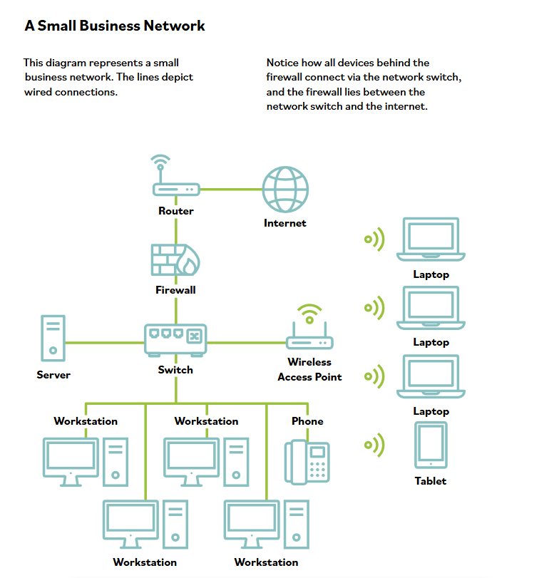

- A Typical Home Network

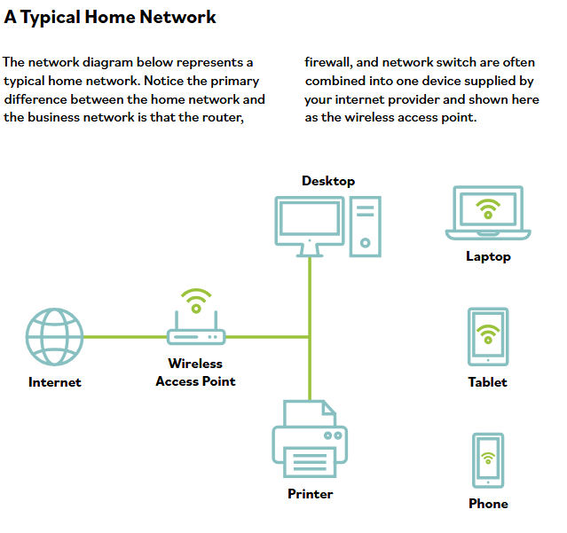

## What is WiFi?
Wireless networking is a popular method of connecting corporate and home systems because of the ease of deployment and relatively low cost.

- Wifi range is generally wide enough for most homes or small officers, and range extenders may be placed strategically to extend the signal for larger campuses or homes. Over time the standards have evolved, with each updated version faster than the last.

- In a LAN, threat actors need to enter the physical space or immediate vicinity of the physical media itself. For wired networks, this can be done by placing sniffer taps onto cables, plugging in USB devices, or using other tools that require physical access to the network. By contrast, wireless media intrusions can happen at a distance.

## Microsegmentation
Modern cyber attacks take advantage of traditional security models to move easily between systems within a data center. Microsegmentation aids in protecting against these threats.

- A fundamental design requirement of microsegmentation is to understand the protection requirements for traffic within a data center and traffic to and from the internet traffic flows.

- When organisations avoid infrastructure-centric design paradigms, they are more likely to become more efficient at service delivery in the data center and become a part of detecting and preventing advanced persistent threats.

### Characteristics of Microsegmentation
- It allows for granular restrictions within the IT environment, to the point where rules can be applied to individual machines and/or users, and these rules can be as detailed and complex as desired.

- It can limit which IP addresses can communicate to a given machine, at which time of day, with which credentials, and which services those connections can use.

- It uses logical rules, not physical rules, and does not require additional hardware or manual interaction with the device.

- It is the ultimate end state of the *defense-in-depth* philosophy; no single point of access within the IT environment can lead to broader compromise

- It is crucial in shared environments, such as the cloud, where more than one customer's data and functionality might reside on the same device(s), and where third-party personnel might have physical access to the hardware.

- It allows the organisation to limit which business functions, units, offices, or departments can communicate with others, to enforce the concept of least privilege.

- In modern environments, it is available through virtualisation and software-defined networking (SDN) technologies.

## Tools to Identify and Prevent Threats

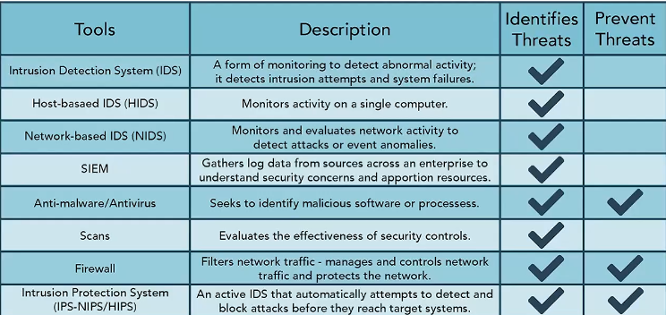

### Intrusion Detection Systems (IDS)
Intrusion detection is a specific form of monitoring that monitors recorded information and real-time events to detect abnormal activity indicating a potential incident or intrusion.

- An Intrusion Detection System automates the inspection of logs and real-time system events to detect intrusion attempts and system failures.

- An IDS is intended as part of a defense-in-depth strategy. It will work with and complement, other security mechanisms such as firewalls, but it does not replace them.

- IDSs can recognise attacks that come from external connections, such as an attack from the internet, and attacks that spread internally.

- The primary goal of an IDS is to provide a means for a timely and accurate response to intrusions.

- Intrusion detection and prevention refer to capabilities that are part of isolating and protecting a more secure or more trusted domain or zone from one that is less trusted or less secure.

- IDS types are commonly classified as host-based and network-based. A host-based IDS (HIDS) monitors a single computer or host. A network-based IDS (NIDS) monitors an entire network or subnet.

#### Types of IDS

1. Host-based Intrusion Detection System (HIDS)
    - it monitors activity on a single computer, including process calls and information recorded in system application, security, and host-based firewall logs.
    - it can often examine events in more detail than an NIDS can, and it can pinpoint specific files compromised in an attack
    - it can also track processes employed by the attacker

2. Network-Intrusion Detection System (NIDS)
    - it evaluates and monitors network activity to detect attacks or event anomalies. It cannot monitor encrypted traffic but can monitor other packet details.
    - a single NIDS can monitor a large network by using remote sensors to collect data at key network locations that send data to a central management console.
    - an NIDS has very little negative effect on the overall network performance, and when it is dpeloyed on a single-purpose system, it doesn't adverselt affect performance on any other computer.
    - it is usually able to detect the initiation of an attack or ongoing attacks, but they can't always provide information about the success of an attack.

### Security Information and Event Management (SIEM)
Security management involves the use of tools that collect information about the IT environment from many disparate sources to better examine the overall security of the organisation and streamline security efforts.

- These tools are generally known as *Security Information and Event Management (SIEM)* systems.
- The general idea of a SIEM solution is to gather log data from various sources across the enterprise to better understand potential security concerns and apportion resources accordingly.
- They can be used along with other components (defense-in-depth) as part of an overall information security program.

### Microsegmentation Characteristics
- It allows for extremely granular restrictions within the IT environment, to the point where rules can be applied to individual machines and/or users, and these rules can be as detailed and complex as desired.

- Microsegmentation are logical rules, not physical rules, and do not require additional hardware or manual interaction with the device.

- Microsegmentation is the ultimate end state of the defense-in-depth philosophy; no single point of access within the IT environment can lead to broader compromise.

- Microsegmentation is crucial in shared environments, such as the cloud, where more than one customer's data and functionality might reside on the same device(s), and where third-party personnel might have physical access to the hardware.

- Microsegmentation allows the organisation to limit which business functions/units/offices/departments can communicate with others, in order to enforce the concept of least privilege.
    - For instance, the HR office probably has employee data that no other business unit should have access to, such as employee home address, salary, medical record, etc. Microsegmentation, like VLANs, can make HR its own distinct IT enclave, so that sensitive data is not available to other business entities, thus reducing the risk of exposure.

- In modern environments, microsegmentation is available because of virtualisation and software-defined networking (SDN) technologies. In the cloud, the tools for applying this strategy are often called "virtual private networks (VPNs)" or "security groups."

### Preventing Threats

- **Keep systems and applications up to date**
    - vendors regularly release patches to correct bugts and security flaws, but these only help when they are applied
    - patch management ensures that systems and applications are kept up to date with relevant patches

- **Remove or disable unneeded services and protocols**
    - if a system doesn't need a service or protocol, it should not be running
    - attackers cannot exploit a vulnerability in a service or protocol that isn't running on a system

- **Use intrusion detection and prevention systems**
    - intrusion detection and prevention systems observe activity, attempt to detect threats, and providew alerts
    - they can also take action to block or prevent attacks

- **Use firewalls**
    - firewalls can prevent many different types of threats
    - network-based firewalls protect entire networks, and host-based firewalls protect individual systems

- **Use up-to-date anti-malware software**
    - a primary countermeasure is anti-malware software.

### Antivirus
The use of antivirus products is strongly encourage as a security best practice and is a requirement for compliance with the Payment Card Industry Data Security Standard (PCI DSS).

- Antivirus systems try to identify malware based on the signature of known malware or by detecting abnormal activity on a system. This identification is done with various types of scanners, pattern recognition, and advanced machine learning algorithms.

- Anti-malware now goes beyond just virus protection as modern solutions try to provide a more holistic approach detecting rootkits, ransomware, and spyware. Many endpoint solutions also include include software firewalls and IDS/IPS systems.

### Scans
- Regular vulnerability and port scans are a good way to evaluate the effectiveness of security controls used within an organisation.

- They may reveal areas where patches or security settings are insufficient, where new vulnerabilities have developed or become exposed, and where security policies are either ineffective or not being followed. Attackers can exploit any of these vulnerabilities.

### Firewalls
Early computer security engineers borrowed the concept of firewalls from the physical world, where a firewall is a barrier designed to prevent the spread of fire within a building. They applied this concept for devices and services where they isolate them in network segments from each other as a way to prevent the spread of malicious traffic. As a result it refers to the process of designing, using, or operating different processes in ways that isolate high-risk activities from lower-risk ones.

- Firewalls enforce policies by filtering network traffic based on a set of rules.

- Firewalls have rapidly evolved over time to provide enhanced security capabilities. This growth in capabilities can be seen in the graphic below, which contrasts an oversimplified view of traditional and next-generation firewalls.

- It integrates a variety of threat management capabilities into a single framework, including proxy services, intrusion prevention services (IPS) and tight integration with the identity and access management (IAM) system to ensure only authorised users are permitted to pass traffic across the infrastructure.

- While firewalls can manage traffic at Layers 2 (MAC addresses), 3 (IP ranges) and 7 (application programming interface (API) and application firewalls), the traditional implementation has been to control traffic at Layer 4.

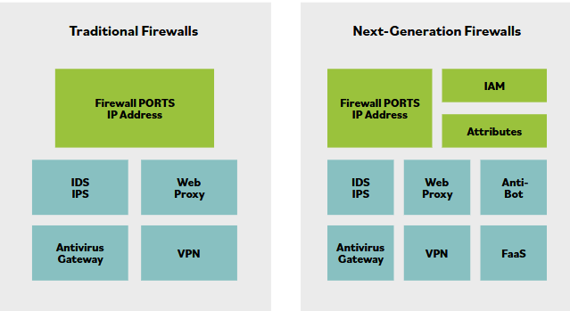

### Intrusion Prevention System (IPS)
An intrusion prevention system (IPS) is a special type of active IDS that automatically attempts to detect and block attacks before they reach target systems.

- a distinguishin difference between an IDS and an IPS is that the IPS is placed in line with the traffic.

- all traffic must pass through the IPS and the IPS can choose what traffic to forward and what traffic to block after analysing it. This allows the IPS to prevent an attack from reaching a target.

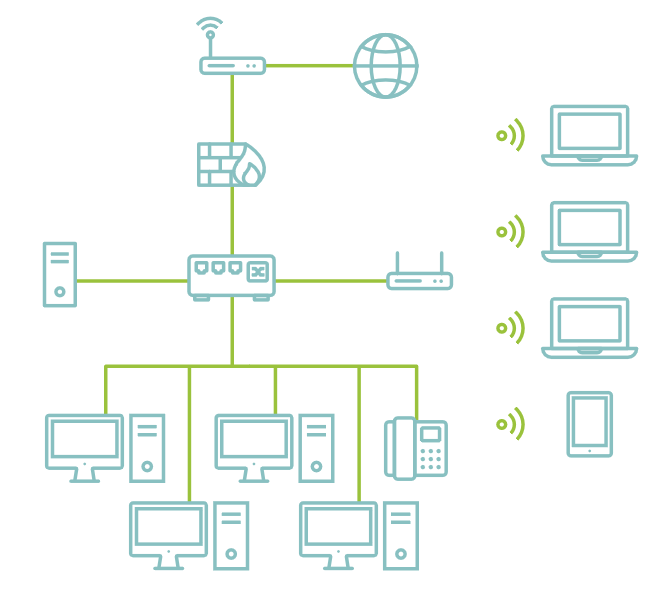

### Network Segmentation (DMZ)
It's an effective way to achieve defense-in-depth for distributed or multi-tiered applications. The use of a DMZ can help protect internal systems from external attacks by isolating public-facing services from the internal network.

- With a DMZ, host systems that are accessible through the firewall are physically separated from the internal network by means of secured switches or by using an additional firewall to control traffic between the web server and the internal network.

- Application DMZs (or semi-trusted networks) are frequently used today to limit access to application servers to those networks or systems that have a legitimate need to connect.

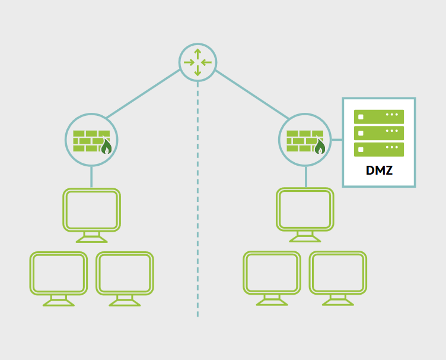

### Virtual Private Network (VPN)
A VPN is not necessarily an encrypted tunnel, but rather a point-to-point connection between two hosts that allows them to communicate.

- Remote users use VPNs to access their organisation's network, and depending on the VPN's implementation, they may have access to all resource just like they were physically on the internal network.

- Organisations also use gateway-to-gateway VPNs which is cheaper than dedicated leased lines to connect remote offices to the main office.

### Web Application Firewall (WAF)
It has an internal and an external connection like a traditional firewall,  with the external traffic being filtered by the traditional or next generation firewall first.

- The WAF is specifically designed to monitor all forms of traffic, encrypted or not, from the outside for malicious behaviour before passing commands to a web server that be internal to the network.

### Virtual Local Area Network (VLAN)
VLANs allow network administrators to use switches to create software-based LAN segments, which can segregate or consolidate traffic across multiple switch ports.

- Since VLANs act as discrete networks, communications between VLANs must be enabled. Broadcast traffic is limited to the VLAN, reducing congestion and reducing the effectiveness of some attacks.

- VLANs do not guarantee a network's security. At first glance, it may seem that traffic cannot be intercepted because communication within a VLAN is restricted to member devices. However, there are attacks that allow a malicious user to see traffic from other VLANs, such as VLAN hopping.

### Redundancy
Redundancy is used to design systems with duplicate components so that if a failure were to occur, there would be a backup. This can apply to the data centre as well. Risk assessments pertaining to the data centre should identify when multiple separate utility service entrances are necessary for redundant communication channels and/or mechanisms

### On-Premises Data Centers
When it comes to data centers, there are two primary options: organisations can outsource the data center or own the data center.

1. **Data Center/Closets**
- The facility wiring infrastructure is integral to overall information system security and reliability. Protecting access to the physical layer of the network is important in minimising intentional or unintentional damage. Proper protection of the phyiscal site must address these sorts of security challenges.

- Data centers and wiring closets may include the following:
    - Phone, network, special connections
    - ISP or telecommunications provider equipment
    - Servers
    - Wiring and/or switch components

2. **Heating, Ventilation, and Air Conditioning (HVAC)/Environmental**
- High-density equipment and equipment within enclosed spaces requires adequate cooling and airflow. Well-established standards for the operation of computer equipment exist, and equipment is tested against these standards.

- For example, the recommended range for optimised maximum uptime and hardware life is from 64°F to 80°F (18°C to 27°C) with a relative humidity of 40% to 60%, and it is recommended that a rack should have three temperature sensosr, positioned at the top, middle, and bottom of the rack.

- Cooling is not the only issue with airflow: Contaminants like dust and noxious fumes require appropriate controls to minimise their impact on equipment. Monitoring for water or gas leaks, sewer overflow, or HVAC failure should be integrated into the building control environment, with appropriate alarms to signal to organisational staff.

- Contingency planning to respond to the warnings should prioritise the systems in the building, so the impact of a major system failure on people, operations or other infrastructure can be minimised.

3. **Power**
- Data centers and information systems in general consume a trememndous amountt of electrical power, which needs to be delivered both constantly and consistently. Wide fluctuations in the quality of power affect system lifespan, while disruptions in supply completely stop system operations.

- Power at the site is always an integral part of data center operations. Regardless of fuel source, backup generators must be sized to provide for the critical load (the computing resources) and the supporting infrastructure. Similarly, battery backups must be properly sized to carry the critical load until generators start and stabilise. As with data backups, testing is necessary to ensure the failover to alternate power works properly.

4. **Fire Suppression**
- For server rooms, appropriate fire detection/suppression must be considered based on the size of the room, typical human occupation, egress routes, and risk of damage to equipment.

### Security of the NETWORK
TCP/IP's vulnerabilities are numerous. Improperly implemented TCP/IP stacks in various operating systems are vulnerable to various DoS/DDoS attacks, fragment attacks, oversized packet attacks, spoofing attacks, and man-in-the-middle attacks.

TCP/IP (as well as most protocols) is also subject to passive attacks via monitoring or sniffing. Networking monitoring, or sniffing, is the act of monitoring traffic patterns to obtain information about a network.

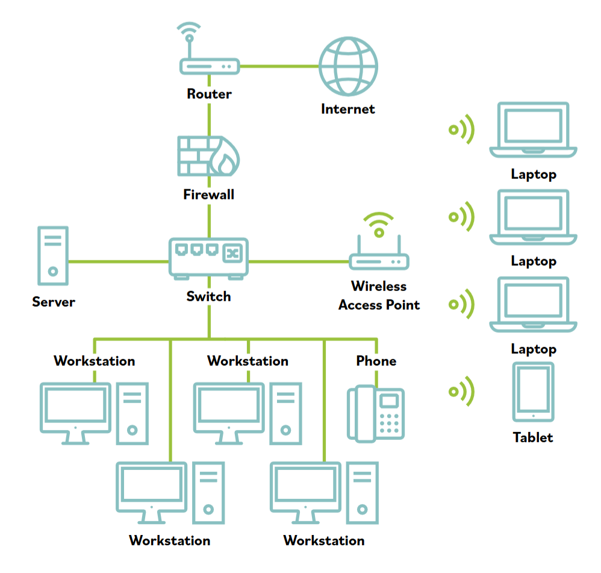

### SYN, SYN-ACK, ACK Handshake
The three-way handshake is a system for synchronising and acknowledging requests to establish a connection between two devices.

It involves three steps:
1. The client sends a SYN (synchronise) message to the server to request a connection.
2. The server responds with a SYN-ACK (synchronise-acknowledge) message to acknowledge the request and synchronise with the client.
3. The client responds with an ACK (acknowledge) message to acknowledge the server's response, and the connection is established.

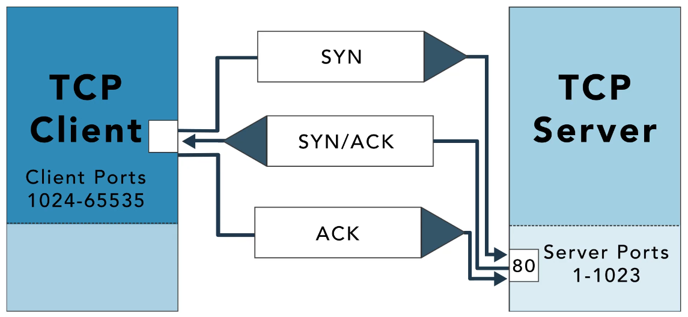

### Cloud Redundancy
Cloud service providers (CSPs) often have multiple data centers in various geographic locations to provide redundancy and high availability for their services.

### Service Models
Some cloud-based services only provide data storage and access. When storing data in the cloud, organisations must ensure that security controls are in place to prevent unauthorised access to the data.

There are varying levels of responsibility for assets depending on the service model. This includes maintaining the assets, ensuring they remain functional, and keeping the systems and applications up to date with current patches.

Types of cloud computing service models include:
- Infrastructure as a Service (IaaS)
- Platform as a Service (PaaS)
- Software as a Service (SaaS)

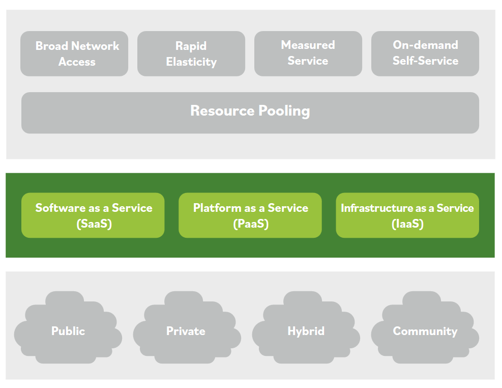

### Managed Service Provider (MSP)
A managed service provider (MSP) is a third-party company that manages information technology assets for another company. Small and medium-sized businesses commonly outsources part or all of their information technology functions to an MSP to manage day-to-day operations or to provide expertise in areas the company does not have. 

Organisations may also use an MSP to provide network and security monitoring and patching services.

Some other common MSP implementations are:
- Augment in-house staff for projects
- Utilise experts for implementation of a product or service
- Provide payroll services
- Provide Help Desk service management
- Monitor and respond to security incidents
- Manage all in-house IT infrastructure

Many MSPs offer cloud-based services, including Managed Detection and Response (MDR) service where vendors monitor firewall and other security tools to provide expertise in triaging events.

### Cloud Characteristics
Cloud-based assets include any resources that an organisation accesses using cloud computing. Cloud computing refers to on-demand access to computing resources available from almost anywhere, and cloud computing resources are highly available and easily scalable. Organisations typically lease cloud-based resources from outside the organisation.

Cloud computing has many benefits for organisations, which include but are not limited to:
- Usage is metered and priced according to units (or instances) consumed. This can also be billed back to specific departments or functions

- Reduced cost of ownership. There is no need to buy any assets for everyday use, no loss of asset value over time and a reduction of other related costs of maintenance and support

- Reduced energy and cooling costs, along with "green IT" environment effect with optimum use of IT resources and systems

- Allows an enterprise to scale up new software or data-based services/solutions through cloud systems quickly and without having to install massive hardware locally.

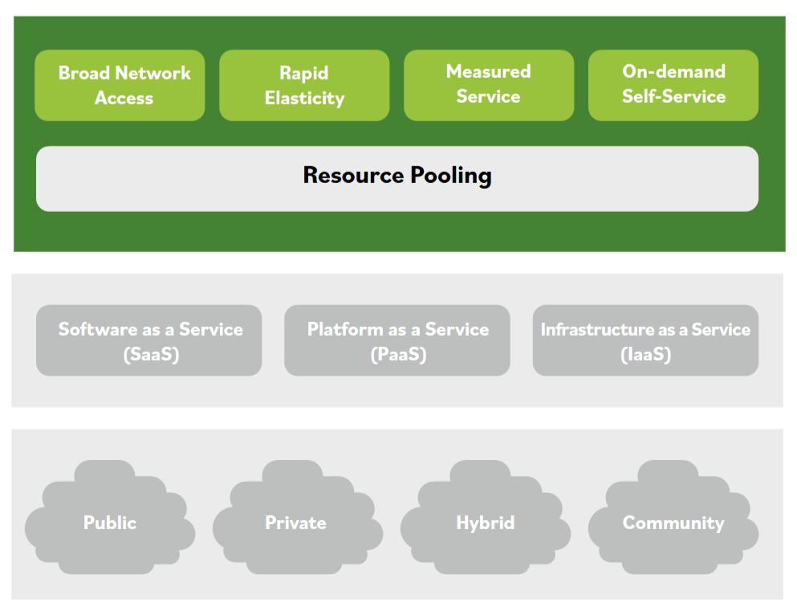

### Cloud
According to the National Institute of Standards and Technology (NIST), cloud computing enjoys widespread global adoption. It outlines a model designed to facilitate pervasive, user-friendly access to a dynamically scalable pool of configurable computing resources, including networks, servers, storage, applications and services.

Cloud computing is similar to the electrical or power grid. It is provisioned in a geographic location and is sourced using an electrical means that is not necessarily obvious to the consumer. However, when you want electricity, it's available via a common standard interface and you pay only for what you use.

Cloud computing is scalable, elastic, and easy-to-use for the provisioning and deployment of IT services.

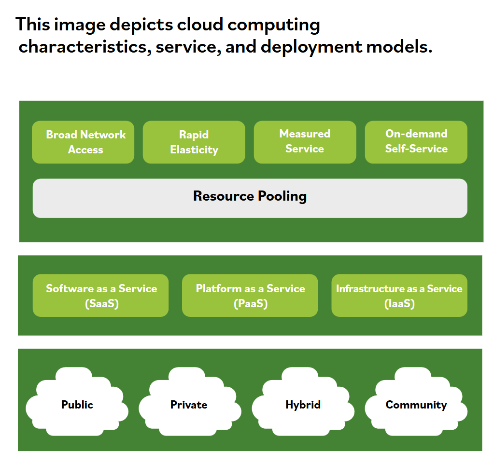

### Service-Level Agreement (SLA)
The cloud computing service-level agreement (cloud SLA) is an agreement between a cloud service provider and a cloud service customer based on a taxonomy of cloud computing-specfic terms to set the quality of the cloud services delivered in terms of a set of measurable properties specific to cloud computing and a given set of cloud computing roles.

The purpose of an SLA is to document specific parameters, minimum service levels, and remedies for any failure to meet the specified requirements. It should also affirm data ownership and specify data return and destruction details.

Other important SLA points to consider include the following:
- Cloud systetm infrastructurer details and security standards
- Customer right to audit legal and regulatory compliance by the CSP
- Rights and costs associated with continuing and discontinuing service use
- Service availability
- Service performance
- Data security and privacy
- Disaster recovery process
- Data location
- Data access
- Data portability
- Problem identification and resolution expectations
- Change management processes
- Dispute mediation processes
- Exit strategy

## Network Design
Network design's objective is to satisfy data communication requirements and achieve the result of efficient overall performance

### Network Access Control (NAC)
At its simplest form, Network Access Control (NAC), is a way to prevent unwanted devices from connecting to a network. Some NAC systems allow for the installation of required software on the end user's device to enforce device compliance to policy prior to connecting.

If the BYOD device is pre-approved and allowed to connect to the corporate network, the NAC system can validate the device using a hardware address or installed software, and even check to make sure the antivirus software and operating system software are up-to-date before connecting it to the network.

Alternatively, if it is a personal device not allowed to connect to the corporate network, it can be redirected to the guest network for internet access without access to internal corporate resources.

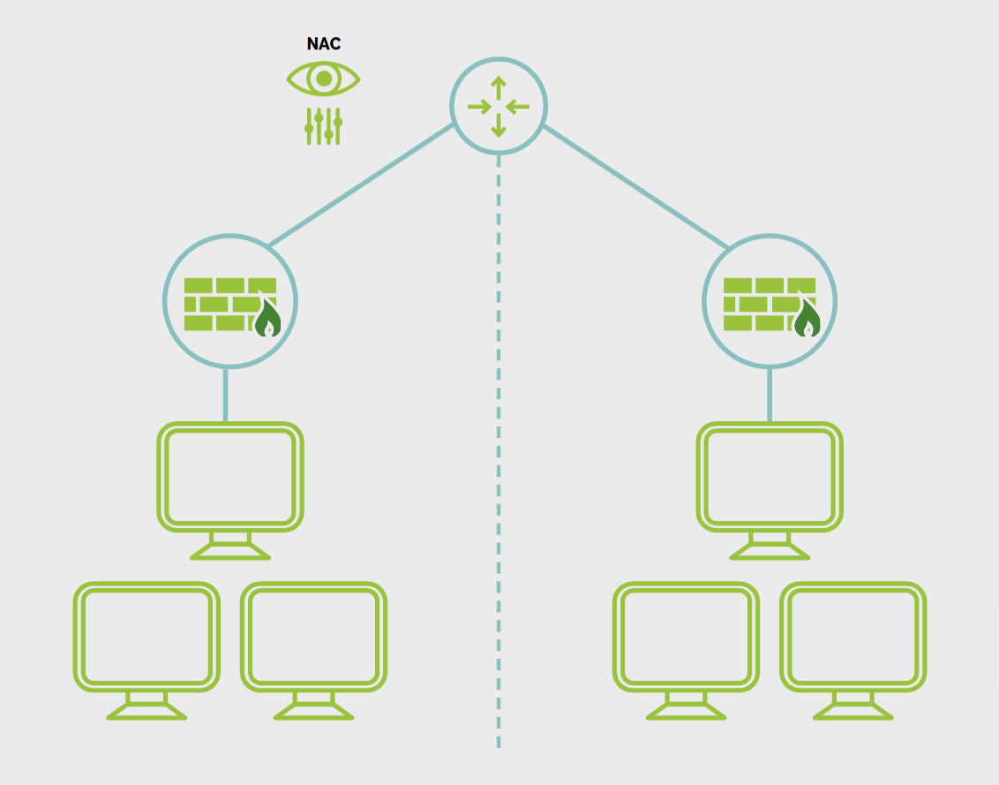

### Memorandum of Understanding (MOU) and Memorandum of Agreement (MOA)
Some organisations seeking to minimise downtime and enhance BC (Business Continuity) and DR (Disaster Recovery) capabilities will create agreements with other, similar organisations. They agree that if one of the parties experiences an emergency and cannot operate within their own facility, the other party will share its resources and let them operate within theirs to maintain critical functions. These agreements often include competitors, because their facilities and resources meet the needs of their particular industry.

These agreements are often called Joint Operating Agreements (JOAs), Memoranda of Understanding (MOUs), or Memoranda of Agreement (MOAs). Sometimes these agreements are mandated by regulatory requirements, or they might be part of the administrative safeguards instituted by an entity within the guidelines of its industry.

The difference between a MOA or MOU and service-level agreement (SLA) is that an MOU/MOA is more directly related to what can be done with a system or the information.

### VLAN Segmentation
VLAN segmentation is a logical method of separating networks without regard to the physical location of the devices. VLANs are configured on network switches to create separate broadcast domains.

It also makes it easier to keep the server-to-server traffic contained to the data center network while allowing certain traffic from workstations or the web to access the servers.

NACs use VLANs to control whether devices connect to the corporate network or to a guest network. Even though a wireless access controller may attach to a single port on a physical network switch, the VLAN associated with the device connection on the wireless access controller determines the VLAN that the device operates on and to which networks it is allowed to connect.

### Ports and Protocols (Applications/Services)
1. Physical Ports
    - Physical ports are the ports on the routers, switches, servers, computers, etc., to which that you connect the wires (e.g., Ethernet cables, fiber optic cables, etc.) that make up the network.

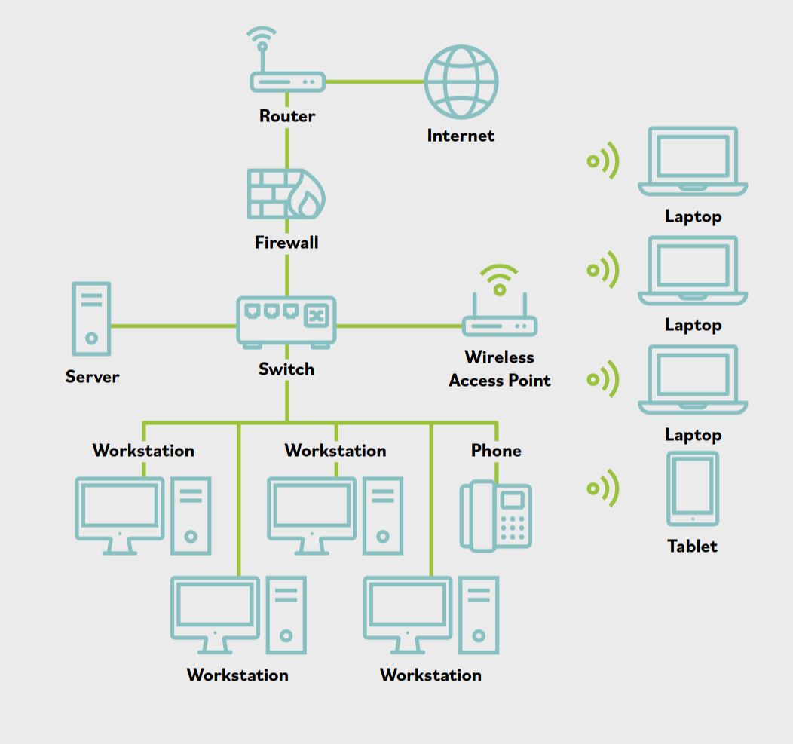

2. Logical Ports
    - When a communication connection is established between two systems, it is done using ports. A logical port (also called a socket) is little more than an address number that both ends of the communication link agree to use when transferring data.
    
    - Ports allow a single IP address to support multiple simultaneous communications, each using a different port number. In the application layer of the TCP/IP Model, which includes the session, presentation, and application layers of the OSI Model, resides numerous application- or service-specific protocols. 

    - Data types are also mapped using port numbers associated with services.

When in doubt, systems should implemented using the most secure version of a protocol and its services.
    
- Ports 0-1023
    - These ports are known as "Well-known Ports" as they are related to the common protocls that are at the core of the Transport Control Protocol/Internet Protocol (TCP/IP) model, Domain Name Service (DNS), Simple Mail Transfer Protocol (SMTP), etc.

- Ports 1024-49151
    - These ports are often associated with proprietary applications from vendors and developers. While they are officially approved by the Internet Assigned Numbers Authority (IANA), in practice many vendors simply implement a port of their choosing.

- Ports 49152-65535
    - These ports are known as "Dynamic or Private Ports" and whenever a service is requested that is associated with a well-known or registered ports, those services will respond with a dynamic port that is used for that session and then released.

### Networking Models
Many different models, architectures and standards exist that provide ways to interconnect different hardware and software systems with each other for the purposes of sharing information, coordinating their activities, and accomplishing joint or shared tasks.

- Translating the organisation's security needs into safe, reliable and effective network systems needs to start with a simple premise. The purpose of all communications is to exchange information and ideas between people and organisations so that they can get work done.

- Those simple goals cam be re-expressed in network and security terms, such as:
    - Provide reliable, managed communications between hosts and users
    - Isolate functions in layers
    - Use packets as the basis of communication
    - Standardise routing, addressing, and control
    - Allow layers beyond internetworking to add functionality
    - Be vendor-agnostic, scalable, and resilient

- In the most basic form, a network model has at least two layers:

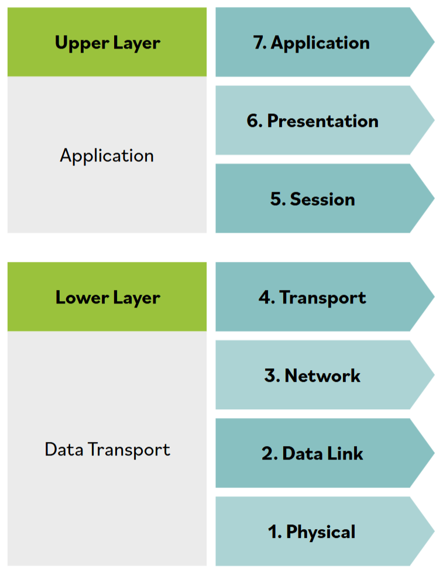

1. Upper Layer
    - Also known as the host or application layer, is responsible for managing the integrity of a connection and controlling the session as well as establishing, maintaining, and terminating communication sessions between two computers. It is also responsible for transforming data received from the application layer into a format that any system can understand. And finally, it allows applications to communicate and determines whether a remote communication partner is available and accessible.

2. Lower Layer  
    - Often referred to as the media or transport layer and is responsible for receiving bits from the physical connection medium and converting them into a frame. 
    - Frames are grouped into standardised sizes. Think of frames as a bucket and the bits as water. If the buckets are sized similarly and the water is contained within the buckets, the data can be transported in a controlled manner. Route data is added to the frames of data to create packets.

### Transmission CControl Protocol/Internet Protocol (TCP/IP) Model 
The TCP/IP model is a concise framework that is used to understand and implement computer networking and data communication. The TCP/IP protocol stack focuses on the core functions of networking.

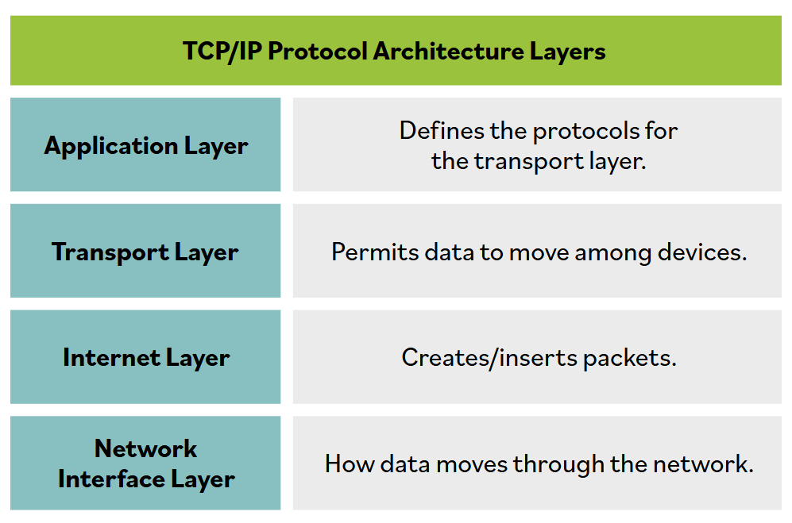

The most widely used protocol suite is TCP/IP, but it is not just a single protocol; rather, it is a protocol stack comprising dozens of individual protocols. TCP/IP is a platform-independent protocol based on open standards. However, this can be a benefit and drawback. TCP/IP can be found in just about every available operating system, but it consumes a significant amount of resources and is relatively easy to hack into because it was designed for ease of use rather than for security.

The two primary transport layer protocols of TCP/IP are TCP and UDP. TCP is a full-duplex connection-oriented protocol, whereas UDP is a simplex connectionless protocol. In the internet later, Internet Control Message Protocol (ICMP) is used to determine the health of a network or specific link. ICMP is utilised by ping, traceroute, and other network management tools. The ping utility employs ICMP echo packets and bounces them off remote systems. Thus, you can use ping to determine whether the remote system is online, responding promptly, or whether the intermediary systems are supporting communications, and the level of performance efficiency at which the intermediary systems are communicating. 

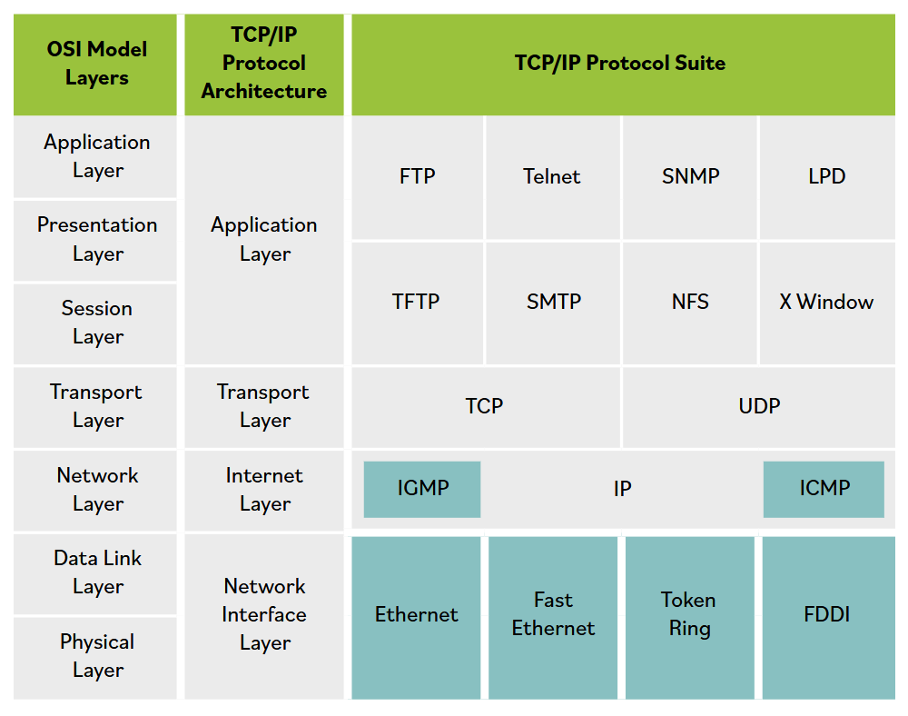

### Segmentation for Embedded Systems and IoT 
An embedde system is a computer system implemented as part of a larger system. The embedded system is typically designed around a limited set of specific functions in relation to the larger product of which it is a component.

The Internet of Things (IoT) is the collection of devices that can communicate over the internet with one another or with a control console to affect and monitor the real world. IoT devices might be labeled as smart devices or smart-home equipment. 

Embedded systems and network-enabled devices that communicate with the internet are considered IoT devices and need special attention to ensure that communication is not used in a malicious manner.

Because an embedded system is often in control of a mechanism in the physical world, a security breach could cause harm to people and property. 

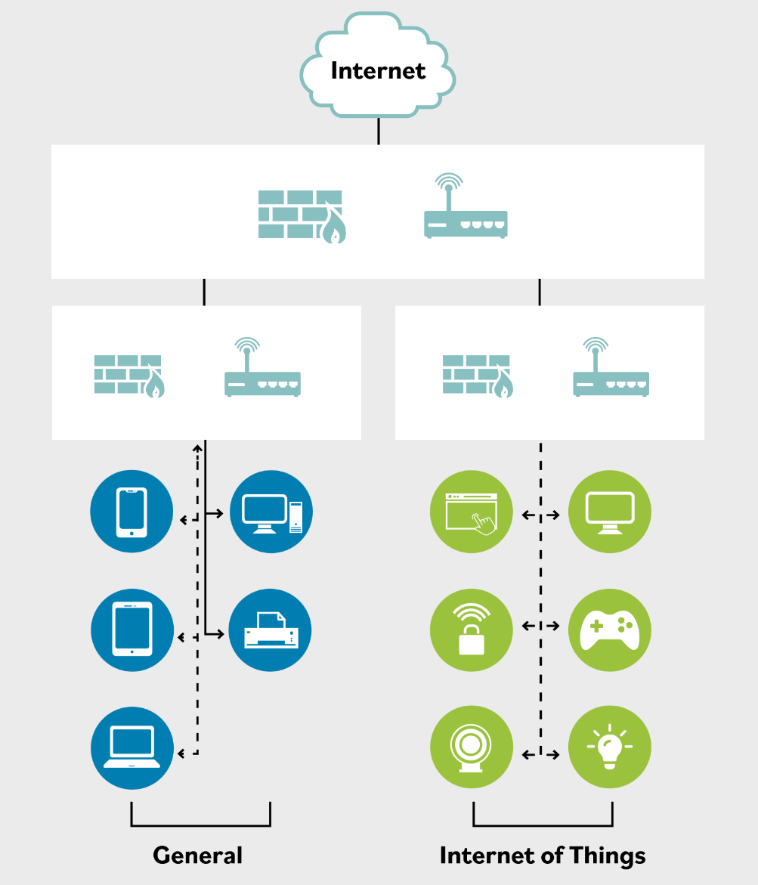

### Open Systems Interconnection (OSI) Model
The OSI model serves as an abstract framework or theoretical model, for how protocols should function in an ideal world, on ideal hardware. Thus, the OSI model has become a common conceptual reference taht is used to understand the communication of various hierachical components from software interfaces to physical hardware.

- The OSI model divides networking tasks into seven distinct layers. Each layer is responsible for performing specific tasks or operations with the goal of supporting data exchange between two computers. The layers are interchangeably referenced by name or layer number.

Encapsulation is the addition of header and possibly footer (trailer) data by a protocol used at that layer of the OSI model. Encapsulation is particularly important when discussing transport, network and data link layer, which all generally include some form of header.

- Encapsulation occurs as the data moves down the OSI model from application to physical. As data is encapsulated at each descending layer, the previous layer's header, payload and footer are all treated as the next layer's payload. The data unit size increases as we move down the conceptual model and the content continue to encapsulate. 

- The inverse action occurs as data moves up the OSI model layers from physical to application. This process is known as **de-encapsulation**. The header and footer are used to properly interpret the data payload and are then discarded. As we move up the OSI model, the data unit becomes smaller. The encapsulation/de-encapsulation process is best depicted in the following graphic:

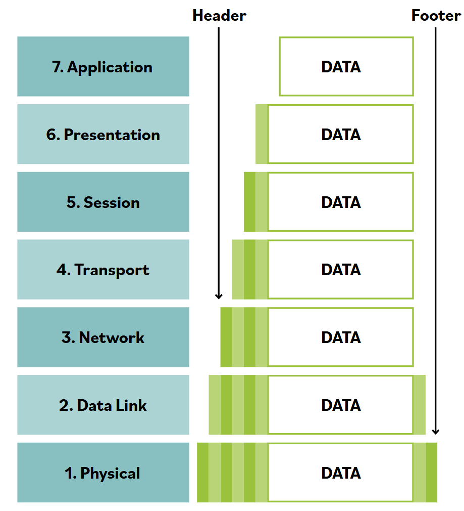

### Deployment Models
There are four cloud  deployment models. The cloud deployment model also affects the breakdown of responsibilities of the cloud-based assets.

The four cloud deployment models are:
1. Public Cloud
    - Commonly referred to as clouds for the public user. It is easy to access a public cloud as there is no real mechanism, other than applying for and paying for the cloud service.
    - It is open to the public and is, therefore, a shared resource that many people can use as part of a resource pool.
    - A public cloud deployment model includes assets available for any consumers to rent or lease and is hosted by an external cloud service provider (CSP). Service-level agreements can be effective at ensuring the CSP provides the cloud-based services at a level acceptable to the organisation.

2. Private Cloud
    - They begin with the same technical concept as public clouds, except that instead of being shared with the public, they are generally developed and deployed for a private organisation that builds its own cloud. Organisations can create and host private clouds using their own resources. 
    - Private clouds provide organisations and their departments private access to the computing, storage, networking, and software assets that are available in the private cloud.

3. Hybrid Cloud
    - A hybrid cloud deployment model is created by combining two forms of cloud computing deployment models, typically a public and private cloud. Hybrid cloud computing is gaining popularity with organisation by providing them with the ability to retain control of their IT environments, conveniently allowing them to use public cloud service to fulfill non-mission-critical workloads, and taking advantage of flexibility, scalability, and cost savings.

4. Community Cloud
    - Community clouds can be either public or private. What makes them unique is that they are generally developed for a particulary community. The idea behind the community cloud is that people of like minds or similar interests can get together, share IT capabilities and services, and use them in a way that is beneficial for the particular interest that they share.

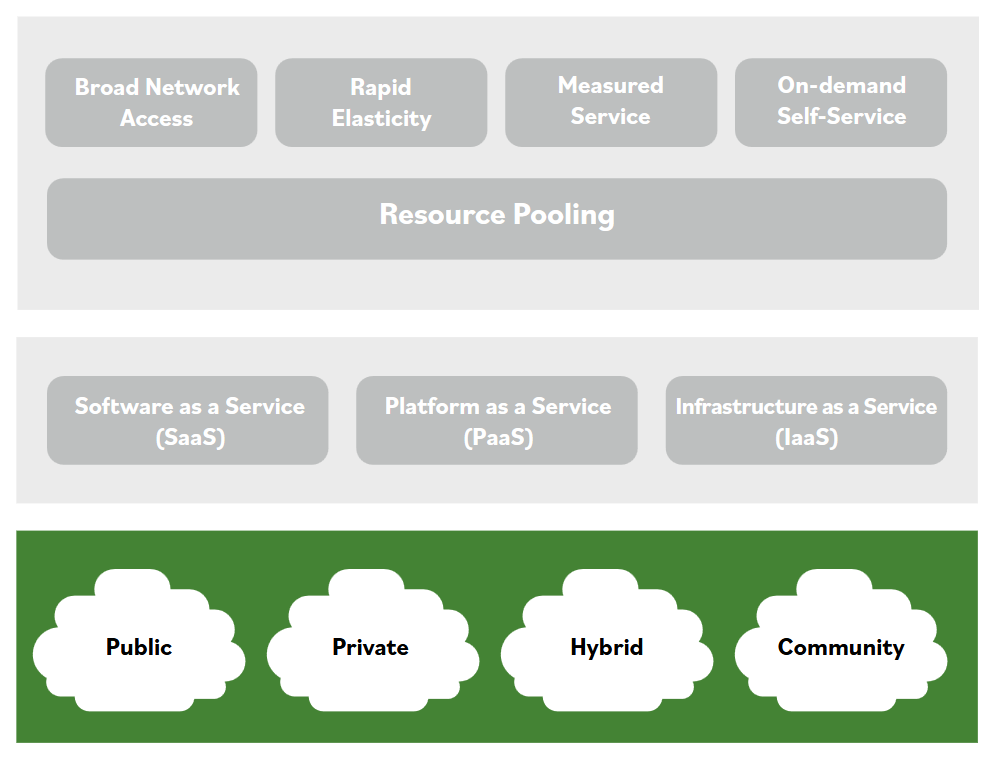

### Zero Trust
Zero trust networks are often microsegment networks with firewalls at nearly every connecting point. Zero trust encapsulates information assets, thte services that apply to them, and their security properties.

- This concept recognises that once inside a trust-but-verify environment, a user has perhaps unlimited capabilities to roam around, identify assets and systems, and potentially find exploitable vulnerabilities. Placing a greater number of firewalls or other security boundary control devices throughout the network increases the number of opportunities to detect a troublemaker before harm is done. Many enterprise architectures are pushing this to the extreme of microsegmenting their internal networks, which enforces frequent reauthentication of a user ID, as depicted in the graphic below.

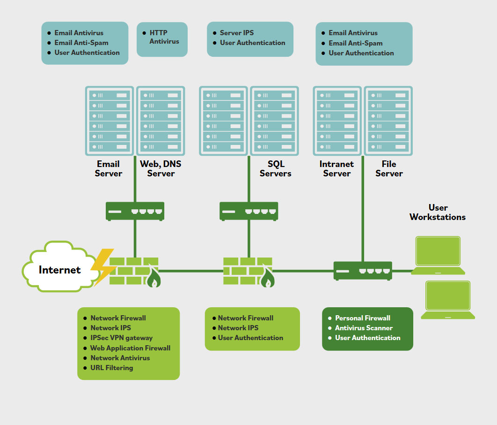

- Zero trust is an evolving design approach that recognises even the most robust access control systems have their weaknesses. It adds defenses at the user, asset and data level, rather than relying on perimeter defense. In the extreme, it insists that every process or action a user attempts to take must be authenticated and authorised; the window of trust becomes vanishingly small.

- While microsegmentation adds internal perimeters, zero trust places the focus on the assets, or data, rather than the perimeter. Zero trust builds more effective gates to protect the assets directly rather than building additional or higher walls. 

### Types of Threats
1. Spoofing
- this is an attacck with the goal of gaining access to a target system through the use of a falsified identity. Spoofing can be used against IP addresses, MAC address, usernames, system names, wireless network SSIDs, email addresses, and many other types of logical identification.

2. Phishing 
- an attack that attempts to misdirect legitimate users to malicious legitimate users to malicious websites through the abuse of URLs or hyperlinks in emails could be considered phishing.

3. DOS/DDOS
- a denial-of-service (DoS) attack is a network resource consumption attack that has the primary goal of preventing legitimate activity on a victimised system. Attacks involving numerous unsuspecting secondary victim systems are known as distributed denial-of-service (DDoS) attacks.

4. Virus
- the computer virus is perhaps the earliest form of malicious code to plague security administrators. As with biological viruses, computer viruses have two main functions—propagation and destruction. A virus is a self-replicating piece of code that spreads without the consent of a user, but frequently with their assistance.

5. Worm 
- worms pose a significant risk to network security. They contain the same destructive potentials as other malicious code objects with an added twist—they propagate themselves without requiring any human intervention.

6. Trojan
- the Trojan is a software program that appears benevolent but carries a malicious, behind-the-scenes payload that has the potential to wreak havoc on a system or network. 

7. On-path Attack
- attackers place themselves between two devices, often between a web browser and a web server, to intercept or modify information that is intended for one or both of the endpoints. On-path attacks are also known as man-in-the-middle (MITM) attacks.

8. Side-channel
- a side-channel attack is a passive, non-invasive attack to observe the operation of a device. Methods include power monitoring, timing and fault analysis attacks.

9. Advanced Persistent Threat (APT)
- refers to threats that demonstrate an unusually high level of technical and operational sophistication spanning months or even years. APT attacks are often conducted by highly organised groups of attackers.

10. Insider Threat
- insider threats are threats that arise from individuals who are trusted by the organisation. These could be disgruntled employeees or employees involved in espionage. Insider threats are not always willing participants. A trusted user who falls victim to a scam could be unwilling insider threat.

11. Malware
- a program that is inserted into a system, usually covertly, with the intent of compromising the confidentiality, integrity, or availability of the victim's data, applications or operating system or otherwise annoying or disrupting the victim.

12. Ransomware
- malware used for the purpose of facilitating a ransom attack. Ransomware attacks often use cryptography to "lock" the files on an affected computer and require the payment of a ransom fee in return for the "unlock" code.

### Defense-In-Depth Part 2
Defense in depth uses a layered approach when designing the security posture of an organisation.

It provides more of a starting point for considering all types of controls—administrative, technological, and physical—that empowers insiders and operators to work together to protect their organisation and its systems.

The following are examples that further explain the concept of defense in depth:

**Data**: Controls that protect the actual data with technologies such as encryption, data leak prevention, identity and access management, and data classification.

**Application**: Controls that protect the application with technologies such as data leak prevention, application firewalls, and database monitors.

**Host**: Every control that is placed at the endpoint level, such as antivirus, endpoint firewall, configuration, and patch management.

**Internal Network**: Controls that are in place to protect uncontrolled data flow and user access across the organisation network. Relevant technologies include intrusion detection systems, intrusion prevention systems, internal firewalls, and network access controls.

**Perimeter**: Controls that protect against unauthorised access to the network. This level includes the use of technologies such as gateway firewalls, honeypots, malware analysis, and secure DMZs.

**Physical**: Controls that provide a physical barrier, such as locks, walls, or access controls.

**Policies, Procedures, and Awareness**: Administrative controls that reduce insider threat (intentional and unintentional) and identify risks as soon as they appear.

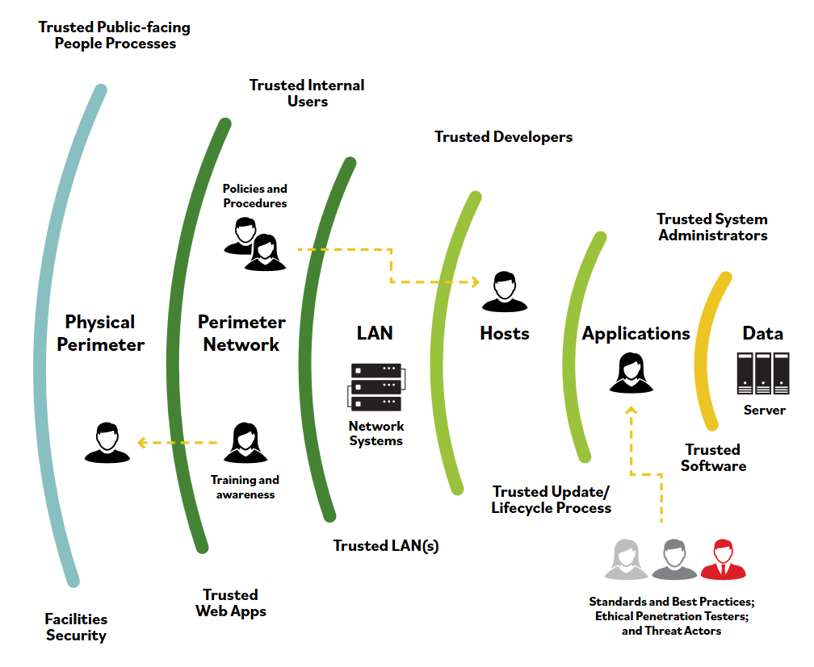

### IPv4 and IPv6
IP is currently deployed and used worldwide in two major versions. IPv4 proides a 32-bit address space, which by the late 1980s was projected to be exhausted. IPv6 was introduced in December 1995 and provides a 128-bit address space, along with several other important features.

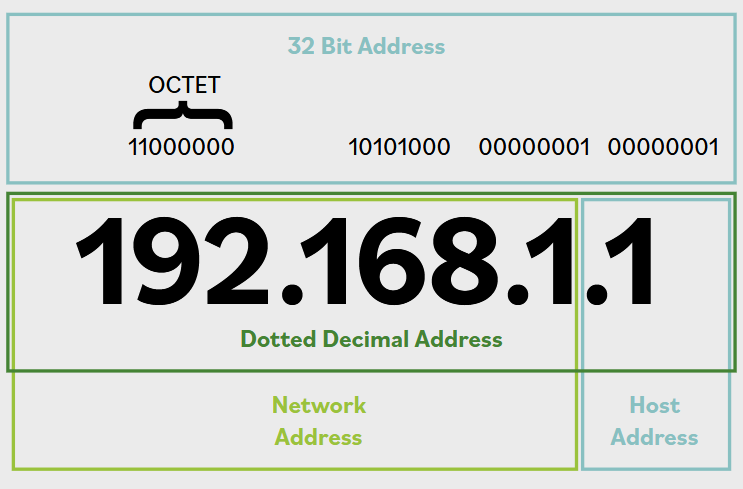

IP hosts/devices associate an address witha unique logical address. An IPv4 address is expressed as four octets separated by a dot.

Each octet may have a value between 0 and 225. However, 0 is the network itself (not a device on that network), and 255 is generally reserved for broadcast purposes. Each address is subdivided into two parts: the **network number** and the **host number**. 

- The network number is assigned by an external organisation, such as the Internet Corporation for Assigned Names and Numbers (ICANN), it represents the organisation's network.

- The host numbers represents the network interface within the network.

To ease network administration, networks are typically divided into subnets. Because subnets cannot be distinguished with the addressing scheme, a separate mechanism, the subnet mask, is used to define the part of the address used for the subnet. The mask is usually converted to decimal notation like 255.255.255.0.

With the increasing amount of devices connecting to the internet, the available IPv4 address space is being exhausted. IPv6 was developed to address this issue by providing a vastly larger address space.

The following table shows the private addresses available for anyone to use:

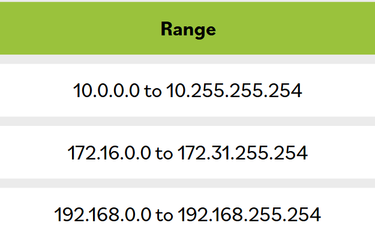

The first octet of 127 is reserved for a computer's loopback address. Usually the address 127.0.0.1 is used. The loopback address provides a mechanism for self-diagnosis and troubleshooting at the machine level. This mechanism allows a network admin to treat a local machine as if it were a remote machine and ping the network interface to establish whether it is operational.

IPv6 is a modernisation of IPv4, which addressed a number of weaknesses in the IPv4 environment:
- **A much larger address field**: IPv6 addresses are 128-bits, which supports 2128 or approximately 3.4 x 1038 unique addresses. This is a significant increase over the approximately 4.3 billion addresses supported by IPv4.

- **Improved security**: IPsec is an optional part of IPv4 networks, but a mandatory component of IPv6 networks. This will help ensure the integrity and confidentiality of IP packets and allow communicating partners to authenticate each other.

- **Improved quality of service (QoS)**: This helps services obtain an appropriate share of a network's bandwidth.

An IPv6 address is shown as eight groups of four digits. Instead of numeric (0-9) digits like IPv4, IPv6 addresses use the hexadecimal range (0000-ffff) and are separated by colons rather than periods.

As in IPv4, there are some addresses and ranges that are reserved for special uses:
- ::1 is the local loopback address, used the same as 127.0.0.1 in IPv4.
- The range 2001:db8:: to 2001:db8:ffff:ffff:ffff:ffff:ffff:ffff is reserved for documentation and examples.

### Secure Ports
Some network protocols transmit information in clear text, meaning it is not encrypted and should not be used. Clear text information is subject to network sniffing. This tactic uses software to inspect packets of data as they travel across the network and extract text such as usernames and passwords.

Network sniffing could also reveal the content of documents and other files if they are sent via insecure protocols. The table below shows some of the insecure protocols along with recommended secure alternatives.

| Insecure Port | Description | Protocol | Secure Alternative Port | Protocol |
|---|---|---|---|---|
| 21-FTP | Port 21, File Transfer Protocol (FTP), sends the username and password using plaintext from the client to the server. This could be intercepted by an attacker and later used to retrieve confidential information from the server. The secure alternative, SFTP, on port 22 uses encryption to protect the user credentials and packets of data being transferred. | File Transfer Protocol | 22*-SFTP | Secure File Transfer Protocol |
| 23-Telnet | Port 23, telnet, is used by many Linux systems and any other systems as a basic text-based terminal. All information to and from the host on a telnet connection is sent in plaintext and can be intercepted by an attacker. This includes username and password as well as all information that is being presented on the screen, since this interface is all text. Secure Shell (SSH) on port 22 uses encryption to ensure that traffic between the host and terminal is not sent in a plaintext format. | Telnet | 22*-SSH | Secure Shell |
| 25-SMTP | Port 25, Simple Mail Transfer Protocol (SMTP) is the default unencrypted port for sending email messages. Since it is unencrypted, data contained within the emails could be discovered by network sniffing. The secure alternative is to use port 587 for SMTP using Transport Layer Security (TLS) which will encrypt the data between the mail client and the mail server. | Simple Mail Transfer Protocol | 587-SMTP | SMTP with TLS |
| 37-Time | Port 37, Time Protocol, may be in use by legacy equipment and has mostly been replaced by using port 123 for Network Time Protocol (NTP). NTP on port 123 offers better error-handling capabilities, which reduces the likelihood of unexpected errors. | Time Protocol | 123-NTP | Network Time Protocol |
| 53-DNS | Port 53, Domain Name Service (DNS), is still used widely. However, using DNS over TLS (DoT) on port 853 protects DNS information from being modified in transit. | Domain Name Service | 853-DoT | DNS over TLS (DoT) |
| 80-HTTP | Port 80, HyperText Transfer Protocol (HTTP) is the basis of nearly all web browser traffic on the internet. Information sent via HTTP is not encrypted and is susceptible to sniffing attacks. HTTPS using TLS encryption is preferred, as it protects the data in transit between the server and the browser. Note that this is often notated as SSL/TLS. Secure Sockets Layer (SSL) has been compromised and is no longer considered secure. It is now recommended that web servers and clients use Transport Layer Security (TLS) 1.3 or higher for the best protection. | HyperText Transfer Protocol | 443-HTTPS | HyperText Transfer Protocol (SSL/TLS) |
| 143-IMAP | Port 143, Internet Message Access Protocol (IMAP) is a protocol used for retrieving emails. IMAP traffic on port 143 is not encrypted and susceptible to network sniffing. The secure alternative is to use port 993 for IMAP, which adds SSL/TLS security to encrypt the data between the mail client and the mail server. | Internet Message Access Protocol | 993-IMAP | IMAP for SSL/TLS |
| 161/162-SNMP | Ports 161 and 162, Simple Network Management Protocol, are commonly used to send and receive data used for managing infrastructure devices. Because sensitive information is often included in these messages, it is recommended to use SNMP version 2 or 3 (abbreviated SNMPv2 or SNMPv3) to include encryption and additional security features. Unlike many others discussed here, all versions of SNMP use the same ports, so there is not a definitive secure and insecure pairing. Additional context is needed to determine whether information on ports 161 and 162 is secured. | Simple Network Management Protocol | 161/162-SNMP | SNMPv3 |
| 445-SMB | Port 445, Server Message Block (SMB), is used by many versions of Windows for accessing files over the network. Files are transmitted unencrypted, and many vulnerabilities are well-known. Therefore, it is recommended that traffic on port 445 should not be allowed to pass through a firewall at the network perimeter. A more secure alternative is port 2049, Network File System (NFS). Although NFS can use encryption, it is recommended that NFS not be allowed through firewalls either. | Server Message Block | 2049-NFS | Network File System |
| 389-LDAP | Port 389, Lightweight Directory Access Protocol (LDAP), is used to communicate directory information from servers to clients. This can be an address book for email or usernames for logins. The LDAP protocol also allows records in the directory to be updated, introducing additional risk. Since LDAP is not encrypted, it is susceptible to sniffing and manipulation attacks. Lightweight Directory Access Protocol Secure (LDAPS) adds SSL/TLS security to protect the information while in transit. | Lightweight Directory Access Protocol | 636-LDAPS | Lightweight Directory Access Protocol Secure |

# DOMAIN 5: Security Operations
## Data Handling
Data goes through its own life cycle as users create, utilise, share, and modify it. Many different models of the life of a data item can be found, but they all have some basic operational steps in common.

The data security life cycle model is useful because it can align easily with the different roles that people and organisations perform during the evolution of data from creation to destruction.

All ideas, data, information, or knowledge can be though of as performing six major sets of activities throughout its lifetime. Conceptually, these involve:

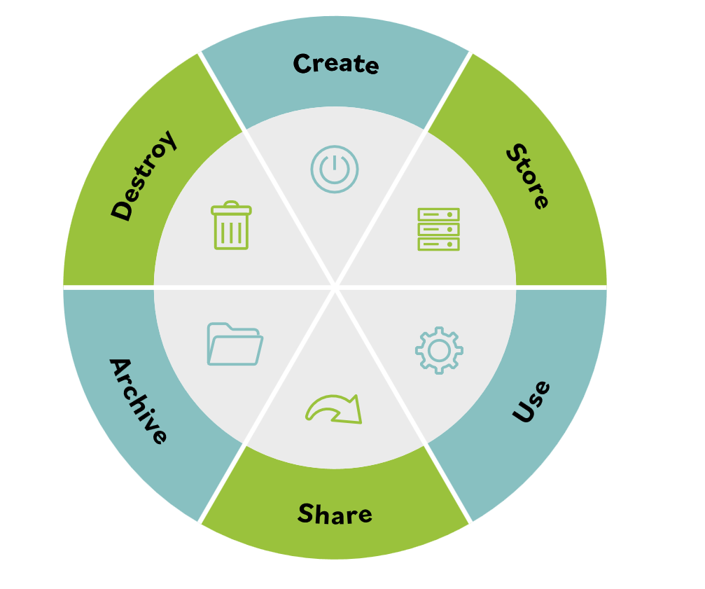

**Create**
Creating the knowledge, which is usually tacit knowledge at this point.

**Store** 
Storing or recording it in some fashion that makes it explicit.

**Use**
Using the knowledge, which may cause the information to be modified, supplemented, or partially deleted.

**Share**
Sharing the data with other users, whether as a copy or by moving the data from one location to anotherr.

**Archive**
Archiving the data when it is temporarily not needed.

**Destroy**
Destroying the data when it is no longer needed.

### Deep Dive on Data Handling
Data handling involves the proper management of data throughout its life cycle to ensure its confidentiality, integrity, and availability. Proper data handling practices help protect sensitive information from unauthorized access, disclosure, alteration, or destruction.

**Degaussing**
- process of reducing or eliminating unwanted magnetic fields (or data) stored on tape and disk media. Degaussing is accomplished by exposing the media to a strong magnetic field that disrupts the magnetic domains that store the data. Degaussing is an effective method for sanitizing magnetic media, such as hard drives and tapes, making it difficult or impossible to recover the data.

**Data Life Cycle**
- refers to the stages that data goes through from its creation to its eventual disposal. The data life cycle typically includes the following stages: creation, storage, use, sharing, archiving, and destruction. Proper management of data throughout its life cycle is essential for ensuring data security, compliance with regulations, and effective data governance.

### Encryption
Encryption protects personal and business transactions; digitally signed software updates verify their creator's or supplier's claim to authenticity.

Cryptography is used to protect information by keeping its meaning or content secret and making it unintelligible to someone who does not have a way to decrypt that protected information.

The objective of every encryption system is to transform an original set of data, called the plaintext, into an otherwise unintelligible encrypted form, called the ciphertext.

**Confidentiality**
Cryptography provides confidentiality by hiding or obscuring a message so that it cannot be understood by anyone except the intended recipient. Confidentiality keeps information secret from those who are not authorised to have it.

**Integrity**
Hash functions and digital signatures can provide integrity services that allow a recipient to verify that a message has not been altered by malice or error. These include simple message integrity controls. Any changes made by the sender or the recipient, either deliberate or accidental, will result in two different results

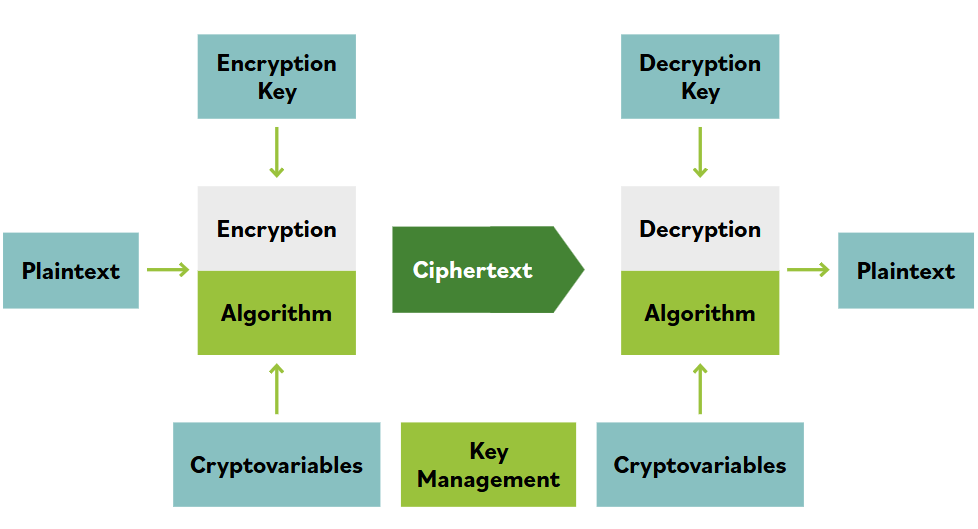

**Encryption System**
An encryption system is a set of hardware, software, algorithms, control parameters, and operational methods that provide a set of encryption services.

**Plaintext**
Plaintext is the data or message in its normal, unencrypted form and format. Its meaning or value to an end user is immediately available for use.

Plaintext can be:
- Image, audio, or video files in their raw or compressed forms.
- Human-readable text and numeric data, with or without markup language elements for formatting and metadata.
- Database files or records and fields within a database.
- Anything else that can be represented in digial form for computer processing, transmission, and storage.

It is important to remember that plaintext can be anything and that much of it is not readable to humans.

### Security Awareness Training
The purpose of awareness training is to make sure everyone knows what is expected of them, based on responsibilities and accountabilities, and to find out whether there is any carelessness or complacency that may pose a risk to the organisation.

### How Passwords Work
Passwords are a shared secret between a user and a system that is used to authenticate the user's identity. Passwords are typically stored in a hashed format, which means that the original password is transformed into a fixed-length string of characters using a mathematical algorithm. When a user enters their password, the system hashes the entered password and compares it to the stored hash. If they match, the user is authenticated.

### Deeper Dive on Common Security Policies
Policies will be set according to the needs of the organisation and its vision and mission. Each of these policies should have a penalty or a consequence attached in case of non-compliance.

Any security or data handling procedures should be backed up by the appropriate policies.

### Phishing 
The use of phishing attacks to target individuals, entire departments, and even companies is a significant threat that the security professional needs to be aware of and be prepared to defend against.

Countless variations on the basic phishing attack have been developed in reecent years, leading to a variety of attacks that are deployed relentlessly against individuals and networks in a never-ending stream of emails, phone calls, spam, instant messages, videos, file attachments, and other delivery mechanisms.

Phishing attacks that attempt to trick highly placed officials or private individuals with sizable assets into authorising large fund wire transfers to previously unknown entities are known as **whaling attacks**

### Hashing
Hashing takes an input set of data of almost arbitrary size and returns a fixed-length result called the **hash value**. A hash function is the algorithm used to perform this transformation. When used with cryptographically strong hash algorithms, this is the most common method of ensuring message integrity today. 

To be useful and secure, a cryptographic hash function must demonstrate five main properties:

**Useful**
- it is easy to compute the hash value for any given message.

**Nonreversible**
- it is computationally infeasible to reverse the hash process or otherwise derive the original plaintext of a message from its hash value, unlike an encryption process, for which there must be a corresponding decryption process.

**Content Integrity Assurance**
- it is computationally infeasible to modify a message such that reapplying the hash function will produce the original hash value.

**Unique**
- it is computationally infeasible to find two or more different, sensible messages that hash to the same value.

**Deterministic**
- the same input will always generate the same hash, when using the same hashing algorithm.

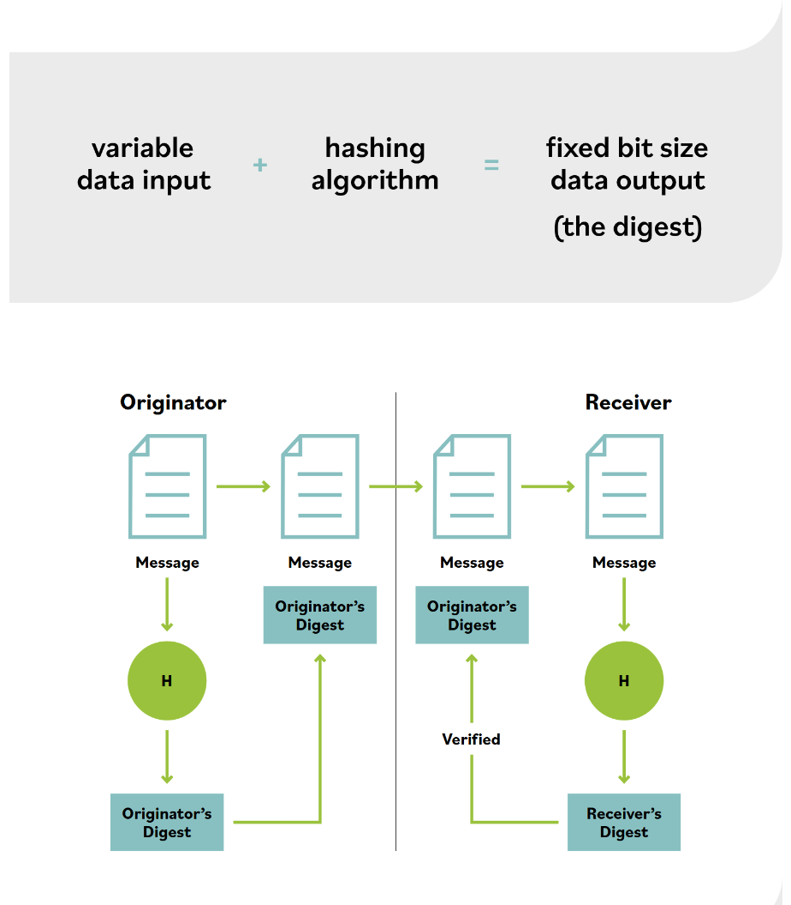

#### Deep Dive on Hashing
Hashing puts data through a hash function or algorithm to create an alphanumeric set of figures, or a digest that means nothing to people who might view it.

No matter how long the input is, the hash digest will be the same number of characters. For example, the SHA-256 algorithm always produces a 256-bit hash value, which is represented as a 64-character hexadecimal string.

Before going live with a software product provided by a third party, always make sure no one has changed anything since it was tested by you and the programmer. You can do this be checking the digest of their code and compare it to the original. This is also known as a **checksum**.

### Change Management in a Workplace
Information security professionals are typically responsible for coordinating change management because they ensure that any changes to systems, applications, or processes do not introduce new risks or vulnerabilities. Their role involves overseeing proper documentation, reviewing potential security impacts, and ensuring compliance with security policies and procedures. While IT and development teams may implement the changes, it is the security team that provides the necessary governance to maintain the organization’s risk posture.

### Change Management Components

1. **Request for Change (RFC)**: A formal proposal for a change, detailing the nature of the change, its purpose, and potential impacts.

2. **Approval**: The process of reviewing and authorizing the proposed change, often involving a Change Advisory Board (CAB) or similar body.

3. **Rollback**: A predefined plan to revert the system to its previous state if the change causes issues or fails.

The change management process typically includes the following components:

**Documentation**
- All of the major change management practices address a common set of core activities that start with a request for change (RFC) and move through various development and test stages until the change is released to the end users. From first to last, each step is subject to some form of formalised management and decision-making; each step produces accounting or log entries to document its results.

**Approval**
- These processes typically include: Evaluating the RFCs for completeness, assignment to the proper change authorisation process based on risk and organisational practices, stakeholder reviews, resource identification and allocation, appropriate approvals or rejections, and documentation of approval or rejection.

**Rollback**
- Depending upon the nature of the change, a variety of activities may need to be completed. These generally include: scheduling the change, testing the change, verifying the rollback procedures, implementing the change, evaluating the change for proper and effective operation, and documenting the change in the production environment

- Rollback authority would generally be defined in the rollback plan, which might be immediate or scheduled as a subsequent change if monitoring of the change suggests inadequate performance.

### Event Logging Best Practices
Different tools are used depending on whether the risk from the attack is from traffic coming into or leaving the infrastructure.

**Ingress Monitoring**
Ingress monitoring refers to surveillance and assessment of all inbound communications traffic and access attempts. Devices and tools that offer logging and alertitng opportunities for ingress monitoring include:

- Firewalls
- Gateways
- Remote authentication
- IDS/IPS tools
- SIEM solutions
- Anti-malware solutions

**Egress Monitoring**
Egress monitoring is used to regulate data leaving the organisation's IT environment. The term currently used in conjunction with this effort is data loss prevention (DLP) or data leak protection. The DLP solution should be deployed so that it can inspect all forms of data leaving the organisation, including:

- Email
- Copy to portable media
- File Transfer Protocol (FTP)
- Posting to web pages/websites
- Applications/application programming interfaces (APIs)

### Symmetric Encryption
The central characteristic off a symmetric algorithm is that it uses the same key in both the encryptiton and the decryption processes. It could be said that the decryption process is a mirror image of the encryption process.

The same key is used for both the encryption and decryption processes. This means that the two parties communication need to share knowledge of the same key.

This type of algorithm protects data, as a person who does not have the correct key would not be able to read the encrypted message. Because the key is shared, however, this can lead to several other challenges.

**Primary uses of Symmetric Algorithms**
- Encrypting bulk data 
- Encrypting messages traversing communications channels
- Streaming large-scale, time-sensitive data

**Other names for symmetric algorithms**
- Same key
- Single key
- Shared key
- Secret key
- Session key

### Logging and Monitoring Security Events
Logging is the primary form of instrumentation that attempts to capture signals generated by events.

 Events are any actions that take place within the systems environment and cause measurable or observable change in one or more elements or resources within the system.

 Logging imposes a computational cost but is invaluable when determining accountability. Proper design of logging environments and regular log reviews remain best practices regardless of the type of computer system.

 Major controls frameworks emphasise the importance of organisational logging practices. 

 Information that may be relevant to being recorded and reviewed include, but is not limited to:
 
 - User IDs 
 - System activities
 - Dates/times of key events
 - Device and location identity
 - Successful and rejected system and resource access attempts
 - System configuration changes and system protection activation and deactivation events.

 Logging and monitoring the health of the information environment is essential to identifying inefficient or improperly performing systems, detecting compromises and providing a record of how systems are used.

 Robust logging practices provide tools to effectively correlate information from diverse systems to fully understand the relationship between one activity and another. 

 Controls are implemented to protect against unauthorised changes to log information. Operational problems with the logging facility are often related to alterations to the messages that are recorded, log files being edited or deleted, and storage capacity of log file media being exceeded.

 ### Asymmetric Encryption
 Asymmetric encryption uses one key to encrypt and a different key to decrypt the input plaintext. This is in stark contrast to symmetric encryption, which uses the same key to encrypt and decrypt.

 Asymmetric key cryptography solves the problem of key distribution by allowing a message to be sent across an untrusted medium in a secure manner without tthe overhead of prior key exchange or key material distribution. It also allows for several other features not readily available in symmetric cryptography, such as the non-repudiation of origin and delivery, access control, and data integrity.

 ### Social Engineering
 Social is an important part of any security awareness training program for one simple reason: bad actors know that it works.

 For cyber attackers, social engineering is an inexpensive investment with a potentially high payoff. Social engineering, applied over time, can extract significant insider knowledge about almost any organisation or individual.

 Most social engineering techniques are not new. Many have even been taught as basic fieldcraft for espionage agencies and are part of the repertoire of investigative techniques used by real and fictional police detectives.

 A short list of the tactics that we see across cyberspace currently includes:

 **Phone phishing or vishing**: Usingg a rogue interactive voice response (IVR) system to recreate a legitimate-sounding copy of a bank or other institution's IVR system. A typical vishing attack will reject logins continually, ensuring the victim enters PINs or passwords multiple times, often disclosing several different passwords.

 **Quid pro quo**: A request for your password or login credentials in exchange some compensation, such as a "free gift," a monetary payment, or access to an online game or service. If it sounds too good to be true, it probably is.

 **Pretexting**: The human equivalent of phishing, where someone impersonates an authority figure or a trusted individual in an attempt to gain access to login information.

 **Tailgating**: The practice of following an authorised user into a restricted area or system. The low-tech version of tailgating occurs when a stranger asks you to hold the door open behind you because they forgot their company RFID.

 Social engineering works because it plays on human tendencies. Educattion, training, and awareness work best to counter or defend against social engineering because they underscore that every person in the organisation plays a role in information security.

 ### Configuration Management Overview
 Configuration management is a process and discipline used to ensure that the only changes made to a system are those that have been authorised and validated.

 It is both a decision-making process and a set of control processes. If we look closer at this definition, the basic configuration management process includes components such as identificationn, baselines, updates, and patches.

 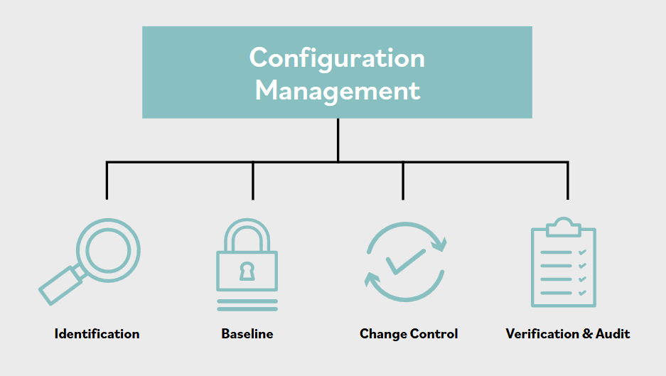

**Identification**
- Baseline identification of a system and all its components, interfaces and documentation.

**Baseline**
- A security baseline is a minimum level of protection that can be used as a reference point. Baselines provide a way to ensure that updates to technology and architectures are subjected to the minimum understood and acceptable level of security requirements.

**Change Control**
- An update process for requesting changes to a baseline, by means of making changes to one or more components in that baseline. A review and approval process for all changes. This includes updates and patches.

**Verification and Audit**
- A regression and validation process, which may involve testing and analysis, to verify that nothing in the system was broken by a newly applied set of changes. An audit process can validate that the currently in-use baseline matches the sum total of its initial baseline plus all approved changes applied in sequence.

#### Inventory
Making an inventory, catalog, or registry of all the informattion assets that the organisation is aware of, whether they already exist, or there's a wish list or need to create or acquire them, is the first step in any assett management process. It requires that we locate and identify all assets of interest, including (and especially) the information assets:

- You can't protect what you don't know you have.

It become even more challenging to keep that inventory, and its health and status with respect to updates and patches, consistent and current, day in and day out. It is, in fact, quitet challenging to identify every physical host and endpoint, let alone gather the data from them all.

#### Baselines
When protecting assets, baselines can be particularly helpful in achieving a minimal protection level of those assets based on value. If assets have been classified based on value, and meaningful baselines have been established for each of the classification levels, we can conform to the minimum levels required.

#### Updates and Patches
Updates and patches are changes to the system that are intended to improve its security posture. Updates and patches may be required to fix vulnerabilities, improve performance, or add new features. It is important to have a process in place for managing updates and patches to ensure that they are applied in a timely manner and do not introduce new vulnerabilities.

### Common Security Policies
Security policies are formalised rules and practices that regulate how an organisation manages, protects, and distributes sensitive information.

**Data Handling Policy**
- This aspect defines whether data is for use within the company, is restricted for use by only certain roles, or can be made public to anyone outside the organisation.

**Password Policy**
- Every organisation should have a password policy in place that defines expectations of systems and users. This policy should define the senior leadership's commitment to ensuring secure access to data, outline any standards that the organisation has selected for password formulation, and identify who is designated to enforce and validate the policy.

**Acceptable Use Policy (AUP)**
- This policy defines acceptable use of the organisation's network and computer systems and can help protect the organisation from legal action. It should detail the appropriate and approved usage of the organisation's assets, including the IT environment, devices, and data.

Policy aspects commonly included in AUPs are:
 - Data access
 - System access
 - Data disclosure
 - Passwords
 - Data retention
 - Internet usage
 - Company device usage

**Bring Your Own Device (BYOD) Policy**
- An organisation may allow workers to acquire equipment of their choosing and use personally owned equipment for business use. 

**Privacy Policy**
- It is imperative that the organisation documents that the personnel understand and acknowledge the organisation's policies and procedures for handling that type of information and are made aware of the legal repercussions of improper protection.

**Change Management Policy**
- Change management is the discipline of transitioning from the current state to a future state. It consists of three major activities: deciding to change, making the change, and confirming that the change has been correctly accomplished. 

- Change management focuses on making the decision to change and results in the approvals to systems support teams, developers, and end users to make the directed alterations.

### Data Handling Practices

**Classification**
- It is the process of recognising the organisational impacts if the information suffers any security compromises related to its characteristics of confidentiality, integrity, or availability. Information is then labeled and handled accordingly based on its classification level.

- The immediate benefit of classification is that tit can lead to more efficient design and implementation of security processes, if we can treat the protection needs for all similarly classified information with the same controls strategy.

**Labeling**
- Security Labels & Data Sensitivity

  - Purpose: Security labels implement controls to protect classified information. Higher sensitivity = greater presumed harm and higher security protection required.
  - Best Practices:
      - Organizations usually create their own classification systems.
      - It's best to have enough classifications to distinguish value/sensitivity, but not so many that it becomes confusing.
      - Typically, 2-3 classifications are manageable; more than 4 are difficult.

Classification Levels:

1.  Highly restricted: Compromise could risk the organization's existence, cause loss of life/injury/property, or lead to litigation.
2.  Moderately restricted: Compromise could lose competitive advantage, revenue, or disrupt planned activities.
3.  Low sensitivity ("internal use only"): Compromise causes minor disruptions or delays.
4.  Unrestricted public data: No harm from further disclosure as it is already public. 

**Retention**
General Retention Principles

The Golden Rule
- Keep data and information only for as long as it is beneficial or required—no more, no less.

Setting Timeframes
- Retention periods are usually defined by laws, regulations, or industry standards. If external requirements don't exist, the organization must define its own policy.

Scope
- These policies apply to both physical hard copies and electronic data.

Destruction & Inventory
- Security professionals are responsible for ensuring data is destroyed once its retention limit is reached. Success here relies on maintaining an accurate inventory that tracks asset location, retention periods, and destruction requirements.

Maintenance 
- Organizations should conduct periodic reviews to reduce stored volume and ensure only necessary information is preserved.

Policy Goals

A solid records retention policy ensures that:

- Personnel Awareness: Staff understand the specific retention requirements for different data types across the organization.

- Documentation: The organization clearly documents the requirements for each type of information.

- Strict Adherence: Systems, processes, and individuals retain information exactly according to the schedule—and not a moment longer.

**Destruction**
Data Remanence & Destruction

- Data remanence is the residual information left on media after standard deletion, representing a significant security risk if it is recovered. Organizations must mitigate this risk through specific sanitization methods to ensure sensitive data cannot be reconstructed by attackers.

- Sanitization methods vary by security requirements and include clearing, purging, and physical destruction. Clearing involves overwriting storage with random values (zeroizing), while purging removes physical magnetic effects (degaussing). For the highest security needs, physical destruction—such as shredding, burning, or acid etching—is the only way to guarantee data is unrecoverable.

Data Retention

- Data retention is the practice of keeping information only for as long as it is legally required or beneficial to the organization. Policies are typically defined by regulations or industry standards, applying to both physical and electronic records to prevent unnecessary storage liability.

- Security professionals are responsible for maintaining an accurate inventory of assets and ensuring data is destroyed exactly when its retention period expires. Periodic reviews of stored data help organizations minimize volume and ensure strict adherence to retention schedules.

Data Sensitivity & Labels

- Security labels are controls used to protect classified information, operating on the principle that higher sensitivity requires stricter protection. Organizations should define a clear classification system—typically 2 to 4 levels—ranging from "Highly Restricted" (where compromise risks the organization's existence) down to "Unrestricted Public Data."

- Best practices dictate that classification systems should be detailed enough to distinguish value but simple enough to avoid confusion. A manageable system typically includes levels for highly restricted data, moderately restricted data, internal-use-only data, and public data.